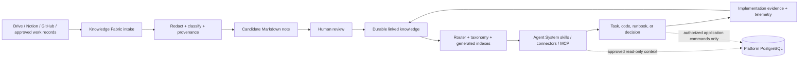

# Obsidian-inspired knowledge loop

Status: design candidate; no product or production activation

This document records how Authority Closers can adopt the useful architecture
behind public Obsidian/agent systems without moving canonical product state out
of the platform database or publishing internal company knowledge.

## Clarification

The public `Rob-Morris/obsidian-brain` repository is an independent project,
not an Anthropic internal leak. Anthropic's relevant official public project is
[`anthropics/knowledge-work-plugins`](https://github.com/anthropics/knowledge-work-plugins),
which packages role workflows as skills, connectors, commands, and sub-agents.

The design pattern is still valuable: human-readable Markdown, explicit
provenance, durable links, a router/taxonomy for retrieval, and auditable
promotion from raw material to trusted knowledge.

## Target AC topology



## Authority rules

- Knowledge Fabric is the durable, human-readable context layer.
- Platform PostgreSQL is canonical for identity, tenancy, access, learning,
  evidence, certificates, audit, and other transactional product state.
- Drive and Notion keep their existing controlled-document and operating-record
  responsibilities.
- Agent retrieval can inform a decision; it cannot grant access, create
  progress, change payment state, or bypass a named application command.
- Corrections supersede prior notes and preserve the historical record.
- Generated graph views, indexes, and summaries are disposable projections.

## File and workflow contracts

Every durable note must have a stable AC ID, one type, a sensitivity level,
promotion status, source references, related links, and a review date. Agents
must enter through the router, read only the taxonomy relevant to the current
intent, and write candidate material to reviewable locations. Accepted policy,
runbook, requirement, or decision notes require human review.

The Agent System should mirror the useful plugin packaging pattern while
remaining AC-specific:

```text
plugin/
  plugin.json
  commands/       # explicit user-invoked workflows
  skills/         # narrow contextual procedures
  connectors/     # least-privilege source adapters
  agents/         # bounded sub-agent roles, when justified
  evals/          # safe, edge, refusal, and provenance cases
```

## First slice and evidence

The first implementation should be limited to:

1. a Knowledge Fabric router and taxonomy index;
2. deterministic vault linting and broken-link checks;
3. one internal role bundle built from existing AC skills;
4. read-only retrieval of approved knowledge;
5. a run record linking source, note, task, files, tests, and outcome.

Evidence is required for each implementation slice: changed files, validation
output, tests where code changes exist, permission boundaries, and unresolved
questions. A public release requires a separate license, secret scan, PII/
confidentiality review, and explicit approval.

## Related systems

- [Authority Closers Knowledge Fabric](../../../AuthorityClosers-Knowledge-Fabric/20-knowledge/systems/AC-SYS-2026-0002-obsidian-inspired-agent-knowledge-loop.md)
- [Knowledge Fabric system baseline](../../../AuthorityClosers-Knowledge-Fabric/20-knowledge/systems/AC-SYS-2026-0001-knowledge-fabric.md)
- [Agent System knowledge-capture skill](../../../AuthorityClosers-Agent-System/skills/knowledge/knowledge-capture/SKILL.md)
- [Platform information architecture](V0_1_FOUNDATION_INFORMATION_ARCHITECTURE.md)
