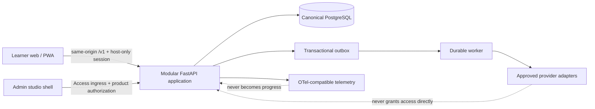
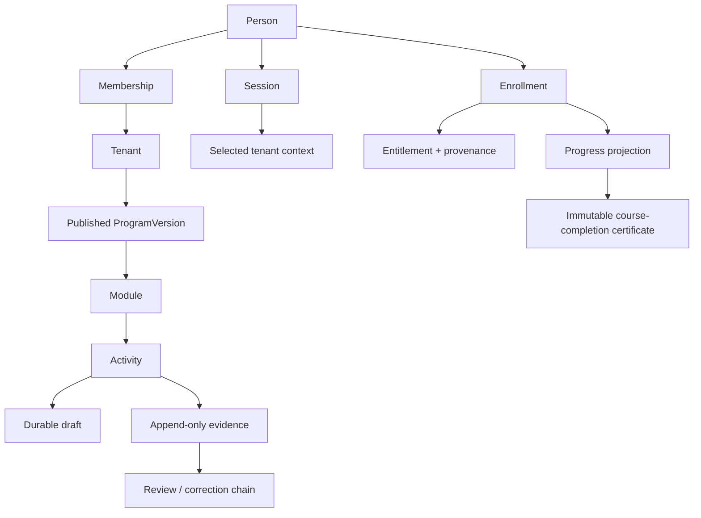

# v0.1 foundation and information architecture

Status: implementation candidate, not a deployment declaration
Boundary: G0/G1 browser-first learning foundation only

This document is the code-facing architecture for the first Authority Closers
platform slice. Controlled AC documents remain authoritative; the source order
is recorded in [`CONTROLLED_SOURCE_REGISTER.md`](../traceability/CONTROLLED_SOURCE_REGISTER.md).

## Ownership and trust boundary

- Canonical implementation repository: private GitHub repository
  `authorityclosers/authority-closers-platform`.
- Canonical product state: one PostgreSQL database reached only through
  migrations and application commands.
- Learner and admin are separate browser applications and host boundaries.
- The modular FastAPI monolith owns identity, tenancy, catalog, enrollment,
  learning, evidence, certificates, admin commands, audit, outbox, and jobs.
- Provider state, analytics, and browser caches are never canonical access,
  payment, progress, or evidence state.

## Information architecture

Every protected command resolves a server-owned actor, active session,
selected tenant, membership, named permission, resource ownership, and
applicable entitlement. URL identifiers and analytics events do not grant
authority. Audit-critical changes append or supersede; they do not erase
history.

## First-slice learner journey

1. Register with email/password or begin same-origin Google authentication.
2. Verify email; the one-time token stays in the URL fragment until the page
   submits it in a JSON body and removes it from browser history.
3. Save, resume, complete, or explicitly skip progressive onboarding.
4. Read the server-published catalog; no local course fixture substitutes for
   an empty API response.
5. Enroll in the approved free version through an idempotent server command.
6. Open the pinned program/module/activity path, save a reflection/workbook
   draft, submit implementation evidence, receive an authorized review, and
   read authoritative progress/completion.

Steps 4-6 are implemented as API and learner adapters. The controlled
four-shift/Module 1 seed and exact-tenant learner provisioning are now present
in the candidate, but activation still requires fresh PostgreSQL CI, exact
staging configuration, seed application, and an end-to-end runtime proof.

## Universal state contract

Every screen family must represent applicable loading, empty, retryable error,
terminal error, offline, permission-denied, locked, partial, and success states.
The service worker caches only the offline shell, manifest/icons, and immutable
Next assets. It never caches `/v1`, authenticated route documents, evidence,
progress, or session-bearing responses.

## Explicit extension contracts

The architecture preserves seams for paid commerce, simulators/call review,
native Windows/iOS, SSO/SCIM, broad B2B/enterprise administration, WhatsApp,
voice, community, MCP/agents, and external media/files. None is part of v0.1,
deployed, or implied complete. Autonomous official scoring and real-call
processing remain closed behind AC-SVAL and governance/consent gates.
