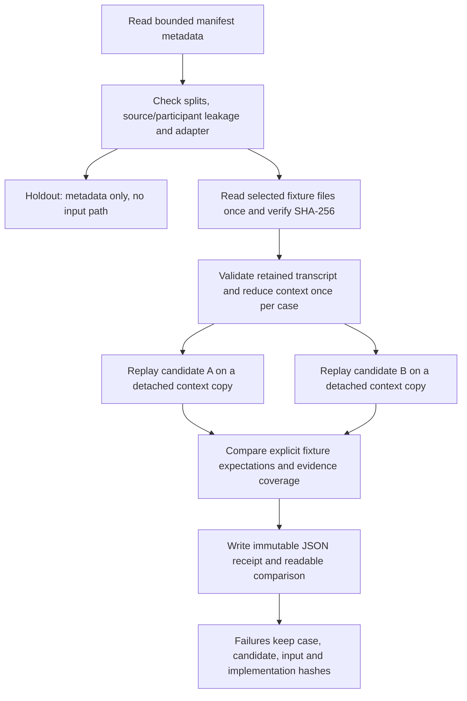

# Offline benchmark and reproduction runner

This is the first executable recipe in the broader
[benchmark plan](../implementation/SALES_XRAY_BENCHMARK_PLAN.md), implementing the
fixture-context portion of package implementation-plan slices 4 and 5. It is an
offline developer tool. It does not activate an Admin test-run API, provider,
recording, reviewer identity, training label or release.

## What runs

`ac_platform.conversation_intelligence.benchmark_cli` loads a strict
`ac.sales-xray.offline-benchmark/1` JSON manifest. The only admitted data class is
`synthetic_fixture`; the only executable adapter is `context-profile-replay/1`.
There are no credential, endpoint, command, plugin-import or paid-execution options.
An unsupported adapter is refused before any fixture is read.

The current fixture manifest has eight authored cases and two candidates. One
candidate copies the preserved Dipak draft; the other is an explicitly synthetic
wording revision with a smaller evidence-packet budget. Both preserve the source's
95 actual / 100 declared discrepancy. They are not approved coaching profiles.

The cases cover the same price concern with absent versus explicit preceding
context, an explicit stop in mixed Hindi/English, authored Marathi text, conflicting
budget statements, a prefix before a later stop, a forged quote and future critical
evidence. A rejection is a passing expectation only at its declared stage. These
are software fixtures, not language-accuracy labels or human review results.

## Input and isolation

- Maximum 64 metadata entries, 32 selected development/calibration cases and four
  candidates. Each JSON file is at most 1 MiB with bounded nesting/node counts;
  duplicate fields and nonfinite numbers are refused. Each case has at most 128
  transcript segments and 64 observations. The run checks a 60-second deadline
  between and after bounded pure operations; it is not an OS process kill deadline.
- Existing `development_cases` validates source and participant partition
  separation. Holdout entries must have `input: null` and cannot be selected.
  All metadata is admitted before any case bytes are read.
- A fixture reference contains only a simple sibling `.json` filename and exact
  file SHA-256. URL, absolute, traversal, symlink, junction and hardlink inputs are
  rejected. The opened file identity must match its pre-open stat.
- Source hashes and fixture permission references identify synthetic inputs; they
  do not grant production or real-call processing rights. Real data is unsupported
  by this protocol, even when an operational report already exists.
- Transcript/observation contents remain in fixture input. The receipt contains
  hashes, bounded IDs, outcomes, coverage and timings. Error messages do not echo
  input text or raw exception details. No secret provider configuration is read.

## Reuse, outcomes and measurements

Each retained transcript is shared by all candidate comparisons for its case.
Context reduction executes once per case. Each candidate gets a detached copy;
mutation is reported and cannot contaminate a later candidate. No ASR or provider
transport exists here. This is local replay evidence, not a proof of hosted
checkpoint-cache behavior (covered separately by durable pipeline tests).

Every row binds case, candidate configuration, source, fixture file, transcript,
context, output projection, packet and implementation hashes. The implementation
hash includes both runner modules and their pure context/checkpoint/review
dependencies. A deterministic suite hash excludes run timing. UUID run directories
are exclusive; reusing an existing ID fails instead of replacing history.

The JSON receipt separates context preparation time from candidate execution.
Per-candidate p50/p95 use nearest-rank elapsed times across all selected cases,
including rejected ones. Comparisons over eight related fixtures are not eight
independent human calls and support no statistical accuracy interval. The runner
does not rank a winner or create a weighted quality score. The CLI also records
process CPU and peak Python allocation under `tracemalloc`; these are not RSS,
native processing, provider latency or VPS capacity measurements.

Exit codes: `0` means every declared fixture expectation passed; `1` means the
completed comparison contains failed expectations; `2` means refusal or incomplete
execution. A created but failed run retains an `incomplete.json` marker. A new run
never overwrites an old one. Reports are stored outside Git; portable synthetic
test receipts may be copied into source evidence with hashes.

## Remaining goal scope

This adapter does not complete the full benchmark program. ASR WER/CER and speaker
metrics, real model comparisons, consented development/calibration data, paired
human judgments, embeddings/retrieval ablations, sealed finalist holdout,
authenticated Admin execution controls and candidate promotion remain separate
implementation/authorization work. Existing exact provider consent, quotes,
reservations and dual reviewer assignments must govern those paths. The runner
cannot resolve the source weights, promote a profile or retrain a model.
