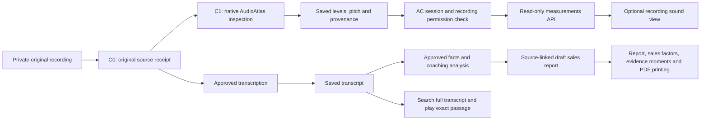

# Sales Xray: report experience and saved audio measurements

This change connects the numbers already saved during audio inspection to the
authenticated report experience. Opening the view does not transcribe the call,
rerun audio inspection, send data to a provider or spend minutes.

## What the person using the app sees

The report leads with its summary and next practice step, followed by findings,
eight sales-factor observations and clickable transcript moments. The full
transcript opens on demand with phrase search, an unverified-speaker filter and
50-row pages; clicking a passage uses its original millisecond timestamp.
The sound section is optional: it shows the
recorded sound level, estimated pitch and a small interactive chart. A missing
measurement stays unavailable. Microphone settings affect these values; they
are not scores for confidence, emotion or sales ability. Physical audio channels
are not identified people.

The compact learner view uses the existing LMS shell. The public report journey
does not open the developer checkpoint workbench. Print / Save PDF uses the
completed, source-validated report and retains its AI draft status. Printing
expands every sales-factor observation and restores the previous open state
afterwards. The paginated transcript is excluded from the report PDF so a partial
transcript is not presented as a full transcript export.

## Data path

The diagram describes the implemented data boundaries, not deployment or provider
execution receipts. External stages require their separately approved run.

## Binding and limitations

- `GET /v1/conversation/recordings/{recording_id}/measurements` uses the current
  AC session, current tenant/owner/permission and recording state. It accepts no
  client-supplied tenant or checkpoint selector and returns private/no-store data.
- The service reads the hashed C1 display payload. Plot data is limited to 1,200
  points per series and at most two physical channels. The client checks the
  selected recording, source digest, units, timing profile and numeric bounds.
- AudioAtlas uses 40 ms windows and 10 ms hops. The saved plots use the decoded
  audio clock. They do not seek the source player because codec origin and delay
  mapping have not been certified.
- SignalLab remains an inspected source with an unimplemented runtime adapter.
  Its different window/clock profiles are not merged into AudioAtlas results.
- Language buttons change interface labels. They do not claim to translate an
  already generated report. Model/provider controls remain an Admin capability.
- English, Hindi, Marathi and mixed controls cover transcript search/filter,
  factor status labels, report section headings and the sound view. Switching
  sound-view labels preserves the displayed value and performs no additional
  measurement request. Stored transcript text, speaker IDs, factor observations
  and analysis text stay unchanged.
- The supplied coaching weights still total 95 despite the declared 100. This
  discrepancy remains in the source/audit contract; no numeric coaching score
  is published by this change.

## Receipts obtained during development

| Check | Result and evidence |
|---|---|
| Initial frozen UX browser | Production `next start`, fresh loopback port 3188. Source hashes in `20260913_SALES_XRAY_LIVE_UX_BROWSER_RECEIPT.json`. Synthetic report/source fixtures. |
| Actual standalone identity flow on initial UX | Passed on `f0bb4f8`: Chromium → real AC HTTP/password cookie → disposable PostgreSQL. `D:/AC-authority-closers-release-audit/sales-xray-standalone-browser-20260913-f0bb4f8-final/standalone-auth-browser.junit.xml`. No Google or provider call. |
| Mounted report client | 63 distinct Sales Xray Vitest cases pass across `measurement-ux-final-vitest.xml` and `measurement-ux-route-regression-fixed.xml` in the external audit directory. The first run found one obsolete source-string assertion for the LMS mount; that assertion was updated for the explicit embedded variant and both integration cases passed. No runtime assertion was removed. Standalone production build, learner typecheck and standalone lint passed. |
| Mounted report browser and PDF | Application source `332b64a`, production build on fresh loopback port 3199. `D:/AC-authority-closers-release-audit/measurement-report-ui-332b64a-stable-20260913/browser-receipt.json` records source/artifact hashes and the successful script. Desktop, 320px mobile, four label modes, playback recovery, measurement slider/missing gaps and print layout passed. The generated synthetic PDF has three pages and contains the draft label and saved measurement. These API/media responses are fixtures, not provider proof. |
| Full transcript and factor mount | All 66 UI tests passed in `D:/AC-authority-closers-release-audit/measurement-report-complete-ux-vitest.xml`. Source `1517d04` passed lint, TypeScript and optimized build; the fresh-port 3201 browser proof is `D:/AC-authority-closers-release-audit/measurement-report-ui-1517d04-20260913/browser-receipt.json`. PDF inspection confirmed four pages, all eight factor labels and observations, the AI draft label and saved sound value. This intermediate source predates the final language/print review corrections. |
| Real measurement API in browser | Source `332b64a`, test overlay `9fba2a14`: actual Chromium → AC password session → HTTP → disposable PostgreSQL passed 11 checks. `D:/AC-authority-closers-release-audit/sales-xray-standalone-browser-20260913-9fba2a1/standalone-auth-browser.junit.xml`. Saved C1 values matched the screen; measurement reads were 200/private-no-store and became 401 after logout. The observed 401 response had no cache-control header. This run did not exercise source audio playback; the following test increment adds that separately. |
| Final source and language corrections | Runtime source `63d5a5edd644bd250acdc8c51694712a3754c7f7`: **67 UI tests passed** (`measurement-final-63d5a5e-vitest.xml`); standalone and learner optimized builds and standalone ESLint passed. Build/lint logs with the same prefix are in `D:/AC-authority-closers-release-audit/`. The focused measurement test also verifies that changing all three non-English modes keeps the value and causes no new fetch. |
| Final production-build browser and PDF | `D:/AC-authority-closers-release-audit/measurement-report-ui-63d5a5e-20260913/browser-receipt.json` binds source hashes, command results, four desktop/mobile label modes and 11 visual/PDF artifacts. Three-page PDF: all eight observations, draft label, selected physical channel and saved measurement present; playback status, channel selector and empty collapsed details absent. The transcript/report text stays literal after language changes. Synthetic API and media fixtures are explicitly identified in this receipt. |
| Final real HTTP/identity/PostgreSQL/audio browser | Source `63d5a5e`, test overlay `d556691`: **1 test, 14 checks passed**. `D:/AC-authority-closers-release-audit/sales-xray-standalone-browser-20260913-63d5a5e-retry3/standalone-auth-browser.junit.xml` and adjacent proof/runtime receipts. The browser used the real AC password session, explicit workspace selection, source-bound imported synthetic report, actual saved native 48 kHz C1 values and real authenticated WAV delivery. Audio duration, play progression and seek passed without substituting `media.play`; source and measurements became 401 after logout. 18 API responses, zero external requests/browser errors/unexpected request failures. This opens a pre-existing synthetic recording; it is not a browser-upload or provider-inference proof. |
| HTTP boundary | 7 passed using frozen project dependencies; `D:/AC-authority-closers-release-audit/measurement-http-boundary-pinned.xml`. Service is substituted in these tests; they are not a database authorization proof. |
| Conversation HTTP regression | 10 passed; `D:/AC-authority-closers-release-audit/measurement-http-regression.xml`. |
| Final measurement service proof | 5 unit tests and 1 disposable PostgreSQL test passed on `527493f8`; `D:/AC-authority-closers-release-audit/measurement-view-postgresql-final-202609132305.xml`. The database test includes native 48 kHz C1 values, exact C0 lineage, self-consistent wrong-parent rejection, tampered payload rejection, foreign-tenant denial before deletion, revocation and deletion. Its 16 kHz branch uses a synthetic persisted receipt to check DTO/profile consistency; it is not a new native 16 kHz benchmark. |

Two earlier HTTP attempts failed because they used the system Python without the
project package/pinned FastAPI. The passing receipt above uses `uv sync --frozen
--offline` and the project environment. Those earlier failures are not counted
as passed checks.

A packaged standalone-server start on Windows failed with `EPERM` at the
generated pnpm React junction. The same optimized build then passed the browser
proof using `next start`. This does not constitute a passing packaged Linux image
test; the source-owned immutable image workflow remains required for release.

The actual browser attempts before the final passing receipt are preserved:
the first attempt could not find the new factor view, a retry rejected the
disposable database URL at setup, and the next exposed an expected source-401
request cancellation during logout/reload. The final test overlay allows that
exact route/method cancellation only after its 401 and logout effects pass;
all events remain in the receipt. None of those earlier attempts are counted
as passing runs.

## Release status at this checkpoint

The newer report/measurement packet has not been deployed. The private staging
frontend is still the immutable `99cdee5` image; its upgrade, rollback and restore
passed in `D:/AC-authority-closers-release-audit/web-99cdee5-artifact/staging-companion-rollback.json`.
That receipt is frontend infrastructure proof, not an authenticated live upload
or provider-analysis proof. Core release, hosted worker activation, public routing,
staging real-call acceptance and production acceptance remain separate gates.
No new real-call processing or provider spend occurred in this UX/measurement slice.

Fresh read-only live checks at 2026-09-13T18:02Z found both learner `/sales-xray`
pages returned 200 and both anonymous conversation-recording APIs returned
401/no-store. Both standalone hostnames failed DNS resolution (local resolver
error 11001). Receipt:
`D:/AC-authority-closers-release-audit/sales-xray-live-baseline-20260913-2332.json`.
These observations do not prove authenticated live upload, analysis or playback.

The runtime branch is pushed as `codex/sales-xray-measurements-ui-20260913`.
Git's merge-tree check against the then-current consolidated release commit
`175058948506a525c0a2833cca69826aedb34510` reported no conflicts, with tree
`4acdbaa6d77cd0606543ae1666f35da34ec84c7e`. The release owner still controls the
combined CI, immutable images and installer. No shared release HEAD was changed
by this lane. The already-requested exact real-call staging/production test
approval remains pending; the old local-only approval is not reused for VPS runs.
