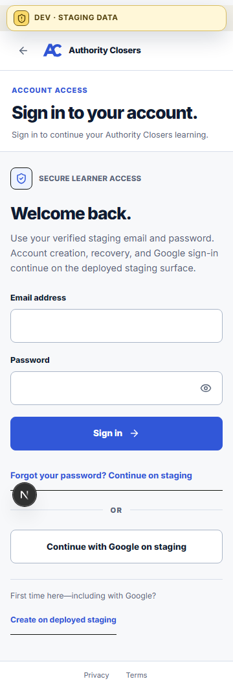
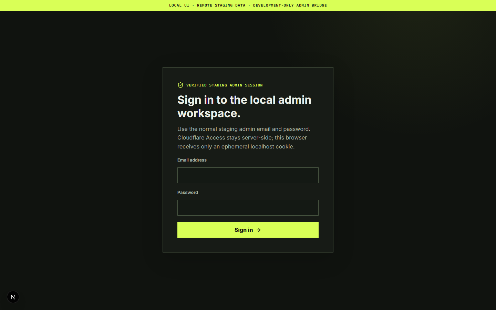

# Local staging development bridge implementation evidence

- Evidence date: 2026-09-04
- Candidate identifier: `AC-LOCAL-BRIDGE-RC1`
- Repository semantic version: `0.1.0`
- Worktree: `C:\Users\Suyash\.codex\worktrees\d2de\authority-closers-platform`
- Branch: `codex/local-staging-dev-bridge`
- Base SHA: `a8bfbfcc2aec6d4d9bcece932511f316fa0dc98a`
- Validated implementation checkpoint SHA: `a5477fe05b4c544270ffb301ad6e26119801c8fa`
- Repository migration head: `20260903_0016`
- Migration-chain tree identity: `d5a91365e593b64392567a2e3c14c3595ed3ce96`
- Database/migration change in this candidate: none
- Remote staging database identity: not asserted; no direct DB/SQL access was used
- Deployment effect: none

## Controlled-source review

The implementation was started only after exact-ID retrieval of the Master
Index, BRD, AC-IMP-00, AC-IMP-01, AC-IMP-03, AC-IMP-04, and AC-IMP-05, followed
by the required PRD, IA, UX research/states/system, SRS, data/tenancy, API/MCP,
Security, Admin, Telemetry, DevOps, QA, ADR/Risk, and relevant AC-UXA-01
assurance sources. Exact identifiers are recorded in ADR-029 and ADR-030. No
business role, tenant, progress, payment, provider, or audit semantics were
inferred from raw founder evidence.

## Implemented boundary

- Learner localhost uses the existing normal password login and an ephemeral
  server-side mapping to the staging host-only product session.
- The learner allowlist now matches the current UI's bounded learning
  collection and avatar calls. Malformed and restart-stale local cookies clear
  themselves; anonymous catalog access remains available after stale state.
- Account creation, recovery, verification, reset, and Google callbacks hand
  off to the canonical staging origin instead of failing through localhost.
- Admin localhost uses the existing human Cloudflare Access identity only for
  edge transport, then requires normal product password login. `/v1/me` and
  `/v1/context` must independently prove the same person, tenant, admin role,
  and `admin_surface` permission before a local mapping is created.
- Browser-supplied remote cookies, Access credentials, bearer/API-key/service
  token fields, arbitrary routes, redirects, oversize bodies, and production
  origins are rejected.
- The launcher binds both Next servers to `127.0.0.1`, persists no credential,
  health-checks both surfaces, and stops only PID/start-time-verified process
  trees from this worktree.

No API deployment, database connection, SQL mutation, VPS port, provider
activation, payment coupling, analytics authority, production configuration,
merge, or production release was performed.

## Included UI/UX changes and limitations

- Added an admin localhost password-login screen and a persistent, explicit
  local-UI/remote-staging notice.
- Learner login now explains the staging trust boundary and sends origin-bound
  registration, recovery, verification, reset, and Google flows to deployed
  staging rather than a denied localhost route.
- Learner and admin stale development cookies recover through explicit clearing
  instead of trapping the browser in repeated denials.
- Admin overview placeholders say `Not measured` and identify absent read
  models instead of presenting a generic connection failure.
- The learner staging notice no longer obscures actions at mobile widths.
- The learner staging notice is visible by default but can be dismissed with
  its accessible close control or toggled with `Alt+Shift+D`
  (`Option+Shift+D` on macOS). Its hidden state is tab-session-only, and the
  shortcut remains active while hidden and after a reload.

Known limitations are intentional: the admin foundation still has no people,
catalog, job, or audit read model; product-password credentials remain
human-entered; Google/provider callbacks stay deployed; and approved lesson
video playback remains blocked until the media/provider/provenance/governance
gates are satisfied. This bridge does not activate that next media slice.

## Automated validation

Validated with the repository-supported Node 24 runtime and pnpm 11:

| Check                                                       | Result                          |
| ----------------------------------------------------------- | ------------------------------- |
| `pnpm --filter @ac/learner-web lint`                        | passed                          |
| `pnpm --filter @ac/learner-web typecheck`                   | passed                          |
| `pnpm --filter @ac/learner-web test`                        | 29 files, 423 tests passed      |
| `pnpm --filter @ac/learner-web build`                       | passed; 25 app routes generated |
| `pnpm --filter @ac/admin-web lint`                          | passed                          |
| `pnpm --filter @ac/admin-web typecheck`                     | passed                          |
| `pnpm --filter @ac/admin-web test`                          | 6 files, 109 tests passed       |
| `pnpm --filter @ac/admin-web build`                         | passed; 9 app routes generated  |
| `uv run pytest -q tests/infra/test_local_staging_bridge.py` | 6 passed                        |
| `git diff --check`                                          | passed                          |

Focused security tests cover exact origin/upstream validation, route matrices,
wrong/missing Origin, browser credential rejection, redirect rejection,
host-only cookie attributes, stale/expired/capped mappings, learner rejection
from admin, identity/context mismatch, Access health semantics, local API mode,
and production non-activation.

## Live runtime validation

The combined workflow was started from a shell whose default `node` was 22;
the launcher found the supported Node 24 runtime later on PATH, prepended it for
the child processes, and started successfully. Human Cloudflare Access login
completed through `cloudflared`; a post-run scan found no Access-JWT-shaped
value or `AC_DEV_ADMIN_ACCESS_JWT` name in the logs. The PID record contained
only repository, timestamp, process name, process ID, and start-time fields.

Observed live results:

| Probe                                               | Result                                                            |
| --------------------------------------------------- | ----------------------------------------------------------------- |
| learner `GET /v1/programs?limit=1`                  | 200, `staging-public-catalog`                                     |
| admin `GET /v1/dev-bridge/health`                   | 200, transport `connected`, product session `sign_in_required`    |
| admin `GET /login`                                  | 200                                                               |
| learner `GET /v1/learning?limit=50` without session | 401, not bridge-route denial                                      |
| learner `GET /v1/profile/avatar` without session    | 401, not bridge-route denial                                      |
| `pnpm dev:staging:down`                             | stopped both PID/start-time-verified process trees; ports cleared |
| subsequent `pnpm dev:staging`                       | both health checks passed and loopback listeners restored         |

An earlier supervised learner browser session completed normal password login
and returned 200 for `/v1/me`, profile avatar, onboarding, catalog, learning
detail, and calendar through the staging bridge. Test credentials and remote
cookies were not read, printed, or recorded.

The admin product-password step was not automated because credentials must
remain user-entered. Unit tests exercise successful admin login with synthetic
opaque cookies and independently verify authorized and rejected identity
contexts. The live Access-transport probe proves only edge reachability and
correctly reports that product sign-in remains required.

## Responsive browser QA

Headless Chromium loaded both local login pages at 360×800, 768×1024, and
1440×900 after `networkidle`. Checks confirmed headings, labelled email/password
fields, development data notices, canonical staging handoff links, absence of
embedded admin email/Access-cookie material, no horizontal overflow, and no
uncaught page errors. The admin no-session overview reached its explicit
`Admin access unavailable` state without a generic connection-failure label.

The first 360px screenshot exposed the learner staging notice overlapping the
password-recovery link. The notice was changed from a fixed overlay to a sticky
flow row; all three viewports then passed and the follow-up screenshot showed
the recovery action unobstructed. A live browser regression also verified
dismissal, session-preserving reload, and keyboard restoration without a layout
gap. QA screenshots remain in ignored local
`.tmp/local-staging-bridge/screenshots` evidence and contain no credentials.

Representative durable screenshots:

## Staging, production, and rollback record

- Staging deployment artifact: none; this candidate has not been deployed.
- Staging deployment result: not run and not authorized by this task.
- Existing staging API release observed by health probe:
  `a8bfbfcc2aec6d4d9bcece932511f316fa0dc98a`; it does not include this candidate.
- Production promotion: not run; no artifact is approved for production.
- Local rollback: `pnpm dev:staging:down` removes only the ephemeral process and
  session boundary; it changes no remote record.
- Code rollback identity: `git revert a5477fe05b4c544270ffb301ad6e26119801c8fa`.
  There is no database downgrade because the migration identity is unchanged.

A later release task must build one immutable artifact from the recorded
candidate SHA, deploy and prove it on staging, record that artifact/digest and
rollback identity, and promote the identical artifact only after all relevant
capability gates pass.

## Handoff state

The localhost servers are intentionally left running from this worktree for
supervised Antigravity UI work. This branch is the single persistent UI
implementation lane and is not an automatic deployment source. Before a future
release, follow `docs/runbooks/ANTIGRAVITY_UI_HANDOFF.md`, reconcile against
current `origin/main`, rerun tests and visual QA, and record the exact included
candidate commit SHA. Production must promote the exact staging-proven artifact
through the existing gates.
