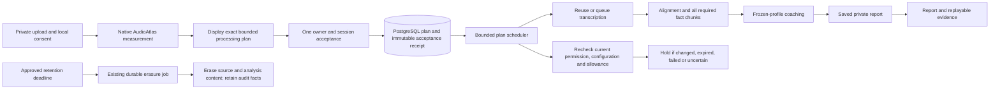

# One consent, durable report progression and retention

This increment follows hosted authority commit `67ae79e4252d2d6be81a0863c7c1fbb3c196b655`.
It implements the next product connection; it is not a staging or production receipt.

The salesperson uploads a private call and approves local audio measurement. After
C1 exists, the app offers one processing plan naming the approved transcription,
facts and coaching providers, their privacy notices, maximum requests and allowance.
Accepting that exact plan starts the saved-checkpoint workflow. Browser polling only
reads progress. The durable worker and scheduler continue accepted work after the
page closes; deploying those processes remains part of the release integration.

## Exact runtime contract

- POST `/v1/conversation/recordings/{id}/plan/quote` has no body or learner provider
  choices. It returns the fingerprint, privacy revision, route notices, expiry,
  zero maximum price and a conservative maximum entitlement duration. No external
  job or user acceptance is created by preparing this plan.
- POST `/v1/conversation/recordings/{id}/plan` accepts `{plan_id, plan_fingerprint,
  privacy_revision, accepted: true}` and an idempotency key. It records one immutable
  AC command/audit receipt and queues the first missing stage atomically. Repeated
  clicks reuse that acceptance. It never fabricates per-stage user-click records.
- GET `/v1/conversation/recordings/{id}/plan` reads the latest saved plan and its
  actual stage, hold, or final report run. The existing manual stage API remains.
  Every route uses current AC identity/tenant/recording ownership, safe write Origin
  and private/no-store responses. The plan has a maximum one-hour execution window,
  further shortened by the release approvals, and a bounded entitlement total.
- A dedicated worker must call `ProcessingPlanScheduler.step()` regularly. A call
  advances at most one plan, queues only the next missing C2/C4/C5 effect using the
  existing atomic budget/minute reservation and job machinery, and stores its next
  check time. Repeated scans reuse immutable task cache keys. C3 and C6 are existing
  deterministic pipeline work. There is no browser-driven provider invocation.
- Each derived quote links to the accepted plan. The inference worker rechecks the
  current owner/session, release artifact, recording generation, exact quote/input,
  frozen profile and plan acceptance before dispatch. Failed or uncertain effects
  hold the plan; changing a request key cannot trigger a paid fallback or redispatch.
- Existing completed transcription/fact checkpoints are verified through their
  canonical provider receipts and reused. A later approved profile can create a new
  coaching result without retranscribing. Transcripts remain separate from coaching.
  A configuration or credential-reference revision alone does not discard valid
  retained results; changing the immutable provider/model/recipe/input changes the
  cache key. Current recording permission and route approval are checked on reuse.
  Text stage plans are reconstructed through the reporting pipeline, which checks
  the actual transcript and fact parent lineage before any derived authorization.
- A new valid login by the same recording owner may read the saved plan and report.
  It cannot accept a quote prepared for another session or execute under that
  session's consent. A fresh plan is required when the previous approval is held.
- Current full-report uploads are limited to 32 MiB, matching the implemented
  provider/broker transport. The generic storage contract remains larger for other
  uses. The app and hosted intake reject oversize recordings before they are stored.

## Migration and erasure

Migration `20260913_0032` adds `conversation_processing_plans` and
`conversation_plan_stage_authorizations`. Composite scope foreign keys bind plans
to the recording/member and derived quotes to their plan. The plan's immutable
manifest and acceptance-command reference are protected by a PostgreSQL trigger;
stage links are append-only. Acceptance itself uses the existing immutable AC
command and audit chain. Existing 0030/0031 migrations are untouched.

`ConversationRetentionScheduler.step()` scans one expired recording using its
source-owned `retention_until`, fences it by advancing the recording generation,
enqueues the existing deletion job, and appends a system audit event. It needs no
live learner session or inference approval. Repeated scans do not enqueue another
deletion. The existing erasure handler removes private objects and clears
source/checkpoint/provider/report/plan content; hashes and consent history survive.
This scheduler does not itself remove provider-side retained data or backups.

## Evidence and remaining release work

The hashed handoff manifest in the release-transfer directory records final test
receipts and exact commit. PostgreSQL/browser fixtures use synthetic audio and
synthetic provider responses, with no new real provider requests. The Next build
and component tests do not substitute for the complete deployed upload UI proof.

Final local receipts (external release-transfer `receipts/` directory):

| Receipt | Observed result and scope |
| --- | --- |
| `processing-plan-final-unit-v1.xml` | 445 passed; conversation unit contracts and HTTP composition |
| `processing-plan-new-pg-v3.xml` | 6 passed; plan acceptance, progression, cache reuse, owner/session boundaries, expiry, immutable history and erasure |
| `processing-retention-parity-v1.xml` | 2 passed; deadline-triggered erasure without a live session, populated migration/model parity |
| `processing-plan-pg-regression-v1.xml` / `processing-plan-legacy-consent-v2.xml` | Broad related run: 18 passed, 1 message assertion failed; restoring the legacy consent message made that focused case pass. The full 19-case scope was not rerun. |
| `processing-plan-source-cap-v1.xml` | 1 passed; HTTP source-cap regression including rejection above 32 MiB before registration |
| `processing-plan-ui-junit-v2.xml` | 17 passed; actual Vitest JUnit, including deferred report polling and strict zero-price plan parsing |
| `processing-plan-next-build-v2.txt` | Next production build and TypeScript passed |
| `processing-plan-ui-eslint-v2.txt` / `processing-plan-ui-format-v1.txt` | ESLint and Prettier passed |
| `processing-plan-browser-root-v1.xml` / `processing-plan-browser-root-v1/plan-browser-probe.json` | 1 passed in 39.23s; real Chromium/TCP, AC cookies, disposable PostgreSQL, synthetic HTML probe and synthetic broker responses |

The browser proof records nine checks: unauthenticated and separately authenticated
other-owner denial, safe write Origin, bodyless side-effect-free quote, one explicit
acceptance, automatic durable C2/C4/C5/C6 completion, source-bound transcript/report,
private byte-range playback, and reload without duplicate provider effects. It has
no browser API route mocks and records no external browser requests. The configured
broker is synthetic: this is not real provider inference or a complete Call Studio
UI test. Earlier failed attempts remain separate receipts and are not counted as
passes. Counts overlap earlier slices and must not be summed as a lifetime total.

Still required: dedicated hosted native/inference worker entrypoints and broker
composition, private volume quotas/mounts, regular plan/retention scheduling,
approved actual recipient/provider/rate/free-allocation/no-overage evidence,
current container/VPS capacity, full hosted Call Studio browser/network acceptance,
canary/rollback and coordinated staging/production release. The first target is the
existing learner and learner-staging `/sales-xray` route; no new DNS is required.

Reports remain private AI drafts pending Dipak's sales/context review and Suyash's
measurement/attribution validation. The source weights remain 95 actual versus 100
declared, and numeric publication remains held. These changes do not certify sales
quality, full SignalLab execution, automatic model promotion or provider pricing.
