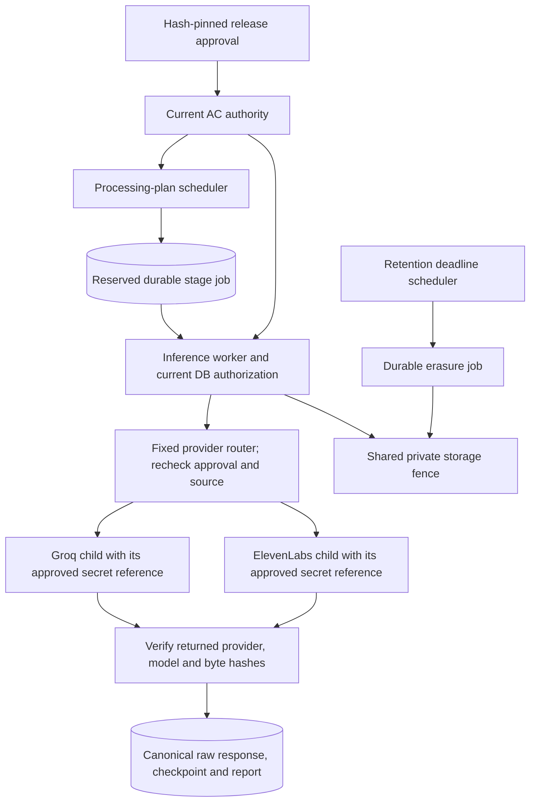

# Reporting worker composition

This follow-on connects the tested processing-plan scheduler, provider-stage worker
and retention scheduler into explicit runtime components. It does not start a
service or certify hosted native execution.

`compose_hosted_reporting(settings, sessions, launchers=...)` reuses the API's
hash-pinned approval loader and private recording store. It maps exact opaque
credential references to separate `ProcessInferenceBroker` children through fixed
provider-specific `InfisicalLauncher` instances. Missing, extra, conflicting or
wrong-provider mappings fail before any child starts. Constructing a runtime does
not claim an allowance, create a provider job, log in to Infisical or invoke a
provider. Disabled configuration remains inert.

The router supports the currently implemented C2 ElevenLabs and C4/C5 Groq routes.
It does not claim that every provider in the broader admin registry has a tested
transport. There is no fallback route. Invalid current approval, changed credential
reference, wrong source/recipe/model/operation, expired permission or a nonzero cost
ceiling stops dispatch. Unexpected child errors become content-free error codes;
cancellation and stable broker errors preserve their existing behavior. The
underlying inference worker still verifies and persists canonical provider receipts
and performs the current database-backed identity/configuration checks.

`ConversationWorkerRunner.run(stop)` calls retention, local/native job handling,
plan advancement and inference serially. It backs off when idle or recovery-held.
Stopping prevents admission of another component; an already accepted call is
joined before cancellation returns. Unexpected errors propagate to the supervisor
instead of becoming an unbounded retry loop. The runner owns no credentials,
settings, database connection creation or generic email worker dispatch.

## Actual activation dependencies

The caller must still provide a tested native sandbox adapter and start the runner
in a dedicated supervised service. `OfflineConversationWorker` remains local/test
only. The API Python image is not an AudioAtlas runtime: it currently lacks the
native binary/source manifest and decoder tools. The separate candidate native
image is deliberately database- and provider-free. Hosted invocation must preserve
that isolation and the existing source/storage fence rather than passing a local
environment flag on a VPS.

The current local C1 worker uses 48 kHz; the candidate native container envelope is
documented for 16 kHz. A hosted profile must explicitly retain the chosen rate in
its C1 cache key and timebase, with measured CPU, memory and disk limits. A silent
rate substitution is not an acceptable runtime connection.

The existing broad VPS Infisical wrapper is not used unchanged by this composition.
The approved launcher must obtain its service authentication only inside the child
boundary and expose only the selected provider credential. Current Infisical CLI
documentation supports token authentication through the child environment and
disabling imports/expansion; actual identity/path setup and execution proof remain
separate. Sources: [Infisical run](https://infisical.com/docs/cli/commands/run) and
[Universal Auth login](https://infisical.com/docs/api-reference/endpoints/universal-auth/login).

On this Windows host, Docker's Linux-engine pipe is unavailable and the WSL Ubuntu
disk could not be mounted. Linux-target mypy checks are type checks, not Linux
container execution. Actual confinement/capacity receipts must come from a working
approved Linux execution environment. No deployment, new real-call request or paid
provider call is implied by the unit/database tests for this composition.
