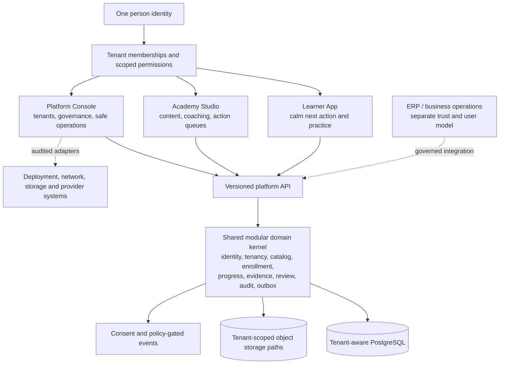

# Multi-tenant Academy Platform direction

Research, repository trail, operational simulation, and implementation plan 
Prepared: 2026-09-04 
Decision status: proposed product-direction addendum; does not supersede controlled Drive sources

## Decision

Evolve the current Authority Closers platform into one multi-tenant Learning & Practice
platform with Authority Closers Academy as its first reference tenant. Keep one domain and
data kernel, but present three deliberately different product experiences:

1. a calm, minimal Learner App;
2. an Academy Studio for the people who create courses, coach learners, and act on evidence;
3. a least-privilege Platform Console for cross-tenant governance and operations.

Do not create a third backend, a second identity system, or a universal super-admin. In the
next slice, Academy Studio should be a role-scoped experience in the existing `admin-web`
application and controlled admin hostname. ERP, infrastructure, network, storage, secrets,
and provider consoles remain separate systems of authority.

This is a redirection of work already in motion, not a restart.

## Executive findings

- The controlled product documents already describe a tenant-aware Learning & Practice OS,
  separate learner and admin experiences, Content Manager and Coach/Reviewer capabilities,
  future B2B readiness, and a separate ERP trust boundary. The proposed direction resolves
  these ideas into a clearer product family; it does not replace them.
- The active branch already contains the hard foundation: tenant ownership, actor-context
  authorization, audit chains, immutable publication, progress/evidence, learner identity,
  PWA behavior, media seams, consent-aware telemetry, background work, recovery, and a
  separate admin application.
- The existing `codex/instructor-admin-workflow` branch is valuable and should be resumed.
  It is intentionally docs-only and correctly refuses to invent an Instructor permission
  union, hostname, assessment schema, autonomous scoring, media policy, or B2B behavior.
- Mature LMS products support the separation being proposed. Open edX has distinct LMS and
  Studio experiences over a shared platform and content store. Moodle Workplace implements
  multiple logically isolated tenants in one instance and explicitly identifies
  cross-tenant permissions. These are patterns to learn from, not products to clone.
- Research warns against building analytics as decoration. Reviews of teacher-facing and
  learner-facing dashboards find that many increase awareness without producing actionable
  intervention or proven learning impact. Academy Studio must therefore lead with a work
  queue and next action, with analytics as evidence supporting that action.
- A new C++17 discrete-event model ran 12,000 cohort replications, representing 3,425,000
  learner trajectories and about 10.29 million human-work jobs. The queue model was checked
  against the Erlang-C analytical result and differed by 0.91% in mean wait.
- In the declared scenarios, a 25-learner Dipak pilot produces about 42 human-work items and
  remains fully within 48 hours, while a future five-tenant configuration at 99.7% of planned
  capacity produces a P95 turnaround of about 432 hours. Near-saturation is a nonlinear
  failure. Workload instrumentation and capacity guardrails are first-class product needs.
- The model is not a completion forecast, staffing commitment, or validation of AC pedagogy.
  All behavioral and service-time assumptions must be recalibrated from consented pilot data.

## Scope and authority

### Controlled-source precedence

The review followed the repository's required source order: Master Index, BRD, AC-IMP-00,
AC-IMP-01, AC-IMP-03, AC-IMP-04, AC-IMP-05, then PRD, IA, UX Research, UX States, UI System,
SRS, Data/Tenancy, API/MCP, Admin, Telemetry, Security, Mobile/PWA, DevOps/SRE, QA, and
ADR/Risk. The learner/admin and accessibility implications were checked against AC-UXA-01;
scoring implications against AC-SVAL-01; and provider, recording, storage, and control-plane
implications against AC-GOV-AUD-001.

The repository's [controlled source register](../traceability/CONTROLLED_SOURCE_REGISTER.md)
and [exact-ID source manifest](../workflows/learner-product-v1/06-screen-family-v0.1-alpha/01-research-journeys/source-manifest.csv)
record the implementation-facing source ledger.

High-authority source links used in this review include:

- [Master Index](https://docs.google.com/document/d/1gC6BdFZ2LfjrpjM-qPKcX1qWMTUBSAXo3b-AlaOYqus/edit)
- [Approved BRD](https://docs.google.com/document/d/1HEp7QN4u3c_636uACznnkruYHhGYHAJWXH7Dlfjybpk/edit)
- [AC-IMP-00](https://docs.google.com/document/d/10tKbAIJWONFNTzK2-NHffy4h1wKgoQP7VdJH_K2eR-A/edit)
- [AC-IMP-01](https://docs.google.com/document/d/1JVnCjDdE79YseM-1PuhvW00xcoicwmhoHtUvEuKKrdU/edit)
- [AC-IMP-03](https://docs.google.com/document/d/1ncsRMiMMiQ39tCn7dV3vpqwUnirY06BgSuVdm_BuIFo/edit)
- [AC-IMP-04](https://docs.google.com/document/d/1gQnsY1JjphpmOmfyCRZkfI-p0TWZjF1PkY1xF744Gnc/edit)
- [AC-IMP-05](https://docs.google.com/document/d/1Vvf1wCA_JjrJQwhkTsgyDM_9179G4M899pWWc3-UdXw/edit)
- [PRD](https://docs.google.com/document/d/1vZGxiP5GRA7He0gA7oF6hmTeHqoEZUIJko_QBUtDW_k/edit)
- [Information Architecture](https://docs.google.com/document/d/1VLJTswU2sqlimfoSIROVvlJ9Z6ue-6Dd45oEcu1ddhs/edit)
- [Data and Tenancy](https://docs.google.com/document/d/1SUxNYTu30NXwBEbk7os1OBVn4H5qBky-LnzLuOvwaYw/edit)
- [Admin and ERP](https://docs.google.com/document/d/12-VjN02jx8M7S8wJrZLcl4OwLcXIFGXKu74wxdJrWuY/edit)
- [Security, Privacy, IAM, Compliance, and Audit](https://docs.google.com/document/d/1rFTiq7BI4dpLLMIDacC8qMhpAbAmOct8W_I65Ydqbmw/edit)
- [Telemetry and Analytics](https://docs.google.com/document/d/1ggdrD_ldZL3ItJsAMONq_ygQFjbR6dOURpeHGXd4M4I/edit)
- [AC-UXA-01](https://drive.google.com/file/d/19eiKLBdm5ziPsqCFZ55f8iHx0DBM43YH/view)
- [AC-SVAL-01](https://drive.google.com/file/d/1gofD6nJn59WZy5OVBE53TCpUQlwcu1MJ/view)
- [AC-GOV-AUD-001](https://drive.google.com/file/d/1bSsGpOCk-kuPs1onrYzkhjqrtA8uvdhu/view)

### What “multi-tenant” means here

It means that tenant identity and ownership are part of every relevant business operation,
authorization decision, record, object path, event, audit record, and derived projection. It
does not mean that every tenant receives a separate codebase, database, mobile app, or custom
workflow on day one.

Authority Closers Academy becomes the first reference tenant in the product model. The exact
tenant identifier, initial membership bootstrap, branding values, and migration procedure
must still be recorded through controlled configuration and tested migrations; they are not
invented in this plan.

### What was not available

The local chat archive states that a complete historical chat transcript is not present. This
review used the current conversation, the available local-only archive metadata and artifacts,
prior LMS research outputs, the Git repository, GitHub pull-request history, and controlled
Drive documents. Missing chat content was not reconstructed or treated as authority. Private
archive material is not copied into this repository.

## Current state: this is an active platform, not a blank LMS

### Historical source checkout and current GitHub trail

- The initial source inventory was collected from the historical recovery branch
  `codex/g1-free-course-foundation` at `af93e2d`: 104 commits from its then-current
  `main`, with a 750-file merge-base diff. Those figures describe the inspected
  recovery snapshot; they do not describe this research PR or recommend merging
  that branch.
- [PR #1](https://github.com/authorityclosers/authority-closers-platform/pull/1) merged the G0 control-plane and VPS foundation.
- [PR #2](https://github.com/authorityclosers/authority-closers-platform/pull/2) remains an open draft for the G1 free-course production foundation. Its current validation checks pass, while the PR remains intentionally gated.
- [PRs #3 through #25](https://github.com/authorityclosers/authority-closers-platform/pulls?q=is%3Apr+is%3Aclosed) show concentrated work across learner UX, release evidence, dependency security, appearance/settings, telemetry, media lifecycle/delivery, video, profile/avatar, staging recovery, progress presentation, and consent-aware analytics ingest.
- Local branch `codex/instructor-admin-workflow` at `21909da` contains a 24-file,
  1,666-line docs-only workflow architecture package. It is reference-ready but correctly
  blocks implementation where controlled role, route, assessment, media, security, or policy
  contracts are missing.

The proper response is not to abandon the learner work or open a new product repository. The
proper response is to declare the product family and route the next slices through the
existing kernel.

### Existing product surfaces

`apps/learner-web` already contains public discovery, registration, verification, onboarding,
home, learning, activity, progress, calendar, notifications, certificates, profile, settings,
offline, recovery, and policy routes.

`apps/admin-web` already contains overview, people, enrollment grants, learning corrections,
catalog, and learning-operations routes. The current Catalog view is explicitly a guarded
studio foundation: it names version and publish gates and refuses to assert unavailable
backend state.

### Existing domain and operational foundation

The implementation already provides useful seams for the proposed product family:

| Existing capability                                  | Why it matters for this direction                                        | Required caution                                                                               |
| ---------------------------------------------------- | ------------------------------------------------------------------------ | ---------------------------------------------------------------------------------------------- |
| `ActorContext(person, session, tenant, permissions)` | One authorization envelope can serve all product experiences             | Current first-slice membership roles are not the full controlled role model                    |
| Tenant and membership persistence                    | AC Academy and future academies can share a kernel                       | Tenant context must be checked server-side and in persistence, not inferred from UI/host alone |
| Program/module/activity and versioning               | Learner delivery and Studio authoring can use the same content model     | Published history must remain immutable; corrections supersede                                 |
| Enrollment, entitlement, progress, evidence          | Studio can inspect canonical learner facts                               | Analytics must not write these facts                                                           |
| Append-safe audit and idempotent admin commands      | Sensitive Studio/Console actions can be accountable                      | No direct database repair path                                                                 |
| Worker/outbox and held-job recovery                  | Review, export, media and notifications can use reliable background work | Job execution cannot silently cross tenants or bypass policy                                   |
| Media provider abstraction and signed delivery       | Course media can evolve behind a stable boundary                         | Provider activation, retention, upload limits, and real-call data remain gated                 |
| Consent-aware telemetry                              | Instructor and product insights can be built from permitted signals      | Events are derived evidence, not progress, payment, entitlement, or official score             |
| Separate learner/admin web apps                      | Calm learner UX and dense operator UX can evolve independently           | Avoid duplicating domain logic in each frontend                                                |

### The most important implementation gap

The controlled Admin specification names Content Manager and Coach/Reviewer roles, but the
current `MembershipRole` implementation only contains learner, support, admin, and owner.
The product must not solve this by calling every admin an Instructor or by hiding permission
unions in navigation code.

The next controlled change needs a permission model that preserves:

- a product label such as “Academy Studio”;
- one or more canonical role assignments;
- server-evaluated permissions such as content read/edit/publish, review read/claim/decide,
  learner read/intervene, and analytics read;
- tenant and resource scope on every action;
- separation of authoring, publication, coaching, finance, technical operations, and
  cross-tenant platform governance.

### Prior LMS research and available chat artifacts

The local-only research archive contains a 212-page LMS study dated 2026-08-19 and two
supporting workbooks. They were reviewed as historical evidence, below the current controlled
documents in authority.

The earlier study catalogued 517 normalized capabilities across 20 competitors and ran one
million Monte Carlo samples over a weighted architecture decision model. Its main conclusion
was an AC-owned modular, multi-tenant core with event-driven seams, shared identity/evidence/
activity foundations, tenant-aware PostgreSQL, and a responsive shared learner app before
tenant-specific native apps. It explicitly framed AC as a learning, practice, coaching, and
data platform rather than a video-course catalogue. That direction is consistent with the
current proposal.

The accompanying model workbook marked tenant-aware persistence, isolation, audit, the
activity SDK, learner shell, and telemetry as early foundations; analytics and white label
were later layers. The feature workbook included instructor analytics, coaching, review,
practice, B2B, and AI capabilities at mixed priorities. Those historical priorities are not
carried forward when they conflict with the current BRD, AC-IMP, AC-UXA, AC-SVAL, or
AC-GOV-AUD gates.

The “one million simulations” in that report were uncertainty samples over a decision model,
not one million learner observations and not causal proof that a capability improves
completion or revenue. The new C++ model in this package answers a different and narrower
question: human-work queue behavior under explicit operational assumptions.

The available archived conversation artifacts center mostly on infrastructure and security
operations. They reinforce restricted admin access, provider boundaries, private database
operation, and controlled staging, but they do not supply missing LMS role, scoring, billing,
or tenant semantics. No such semantics are inferred from them.

## Research findings and design consequences

### 1. Separate experiences can share one platform kernel

[Open edX architecture](https://docs.openedx.org/en/latest/developers/references/developer_guide/architecture.html)
describes an LMS for learners and Studio for course teams within the same core platform. Both
work with the same course content store. This is a useful case study for AC: experience
separation does not require domain duplication.

Open edX also distinguishes content editing from publishing: its
[course roles and permissions](https://docs.openedx.org/projects/openedx-authz/en/stable/concepts/core_roles_and_permissions/course_roles.html)
allow a Course Editor to create and edit without publishing. AC should preserve this kind of
separation even if Dipak initially holds both controlled permissions.

Consequence: build Academy Studio as a product experience over shared services and explicit
permissions. Do not copy learner/course data into a separate “instructor system.”

### 2. Tenant isolation is a platform property, not a branding feature

[AWS SaaS Lens](https://docs.aws.amazon.com/wellarchitected/latest/saas-lens/tenant-isolation.html)
calls tenant isolation foundational and warns that cross-tenant access can be a significant,
potentially unrecoverable event. [Moodle Workplace](https://docs.moodle.org/502/en/Multi-tenancy)
shows a single instance whose data and configuration are virtually partitioned for each
tenant. Its [technical documentation](https://docs.moodle.org/502/en/Multi-tenancy_Technical)
explicitly distinguishes tenant-aware capabilities from cross-tenant permissions.

Consequence: the Studio shell must never select a tenant merely from a client-controlled
field. The server resolves membership, resource ownership, action, and scope. Cross-tenant
platform actions require separately granted platform permissions and stronger audit.

### 3. A control plane must be bounded because it is powerful

[Azure's multitenant control-plane guidance](https://learn.microsoft.com/en-us/azure/architecture/guide/multitenant/considerations/control-planes)
separates the user-facing data plane from higher-level onboarding, configuration, access,
telemetry, consumption, and maintenance responsibilities. It also warns that control planes
are highly privileged and can become catastrophic security boundaries. The same guidance
recommends a progressive approach: a small number of tenants can begin with documented,
repeatable operations before a full self-service control plane is justified.

Consequence: AC needs a Platform Console, but not an omnipotent ERP/network/storage console.
Begin with tenant registry, status, configuration, feature flags, usage visibility, audit,
and safe lifecycle orchestration. Keep secrets, raw storage, networks, and deployment systems
behind their own identities, policies, provider interfaces, and infrastructure-as-code.

### 4. Role names are not a sufficient authorization model

The [NIST RBAC model](https://www.nist.gov/publications/nist-model-role-based-access-control-towards-unified-standard)
formalizes users, roles, permissions, sessions, hierarchies, and separation-of-duty
relationships. NIST's [ABAC project](https://csrc.nist.gov/Projects/attribute-based-access-control)
adds attributes of the subject, object, action, and environment.

Consequence: retain human-readable roles, but make the enforcement decision
`actor + tenant + resource + action + context`. Product labels and navigation groupings must
not become security shortcuts.

### 5. Learner simplicity is instructional, not cosmetic

The controlled UX and UI sources already call for a calm, directional, mobile-first learner
experience. The external literature supports the same boundary. A major review of
[cognitive architecture and instructional design](https://doi.org/10.1007/s10648-019-09465-5)
argues for reducing extraneous cognitive load and keeping total load within working-memory
limits; segmentation is particularly useful for novices.

Consequence: the Learner App should answer four questions quickly:

1. What should I do next?
2. Why does it matter?
3. What have I completed?
4. Where can I get help?

Tenant configuration, content version identifiers, review staffing, event charts, audit
history, and operational health do not belong in ordinary learner navigation.

### 6. Feedback should explain the task and next improvement

[Shute's review of formative feedback](https://doi.org/10.3102/0034654307313795)
and [Hattie and Timperley's feedback review](https://doi.org/10.3102/003465430298487)
support feedback that is timely, specific, manageable, and focused on task, process, and
self-regulation rather than generic praise.

Consequence: the Coach workspace should structure evidence-linked feedback around:

- the target or rubric criterion;
- the exact learner evidence;
- what worked;
- what needs to change;
- one next practice action;
- the human reviewer and decision provenance.

This does not authorize a rubric, score classes, or AI-generated official decision. Those
remain controlled and AC-SVAL-gated.

### 7. Dashboards need intervention loops, not more charts

A systematic review of [50 teacher-facing dashboard studies](https://doi.org/10.1186/s41239-023-00394-6)
found that most dashboards aimed to increase awareness but offered limited actionable insight,
were usually prototypes or pilots, and were commonly evaluated with self-report instead of
changes in teaching or learning. A review of
[learner-facing dashboards](https://doi.org/10.1111/bjet.13089) similarly found uncertainty
around theoretical grounding and alignment between intended outcomes and evaluation.
[Matcha and colleagues](https://doi.org/10.1109/TLT.2019.2916802) reached a related conclusion
from a self-regulated-learning perspective.

Consequence: no Studio metric ships without this contract:

| Required field        | Example form, not a frozen business rule                               |
| --------------------- | ---------------------------------------------------------------------- |
| Decision              | “Which learners need a human check today?”                             |
| Canonical inputs      | enrollment, activity progress, evidence state, review state            |
| Derived signal        | overdue review, stalled activity sequence, repeated retry              |
| Confidence/limitation | insufficient signal, delayed event, consent excluded                   |
| Authorized action     | open evidence, claim review, send approved intervention                |
| Owner                 | named Coach/Reviewer or Content Manager                                |
| Success measure       | queue age, intervention completion, next activity attempt              |
| Guardrail             | no automatic access, progress, payment, publication, or score mutation |

The home page for Dipak should therefore be “Today’s work” rather than “Analytics.” Trends
and cohort exploration remain secondary.

### 8. Instructor workload must be measured locally

Published results are mixed and course-dependent. One longitudinal case study,
[Teaching Courses Online: How Much Time Does It Take?](https://doi.org/10.24059/olj.v7i3.1844),
observed roughly 3–7 hours per week for 25-student asynchronous courses, with high email load
at the beginning and end and persistent discussion/grading work. A comparative study,
[Teaching Time Investment](https://doi.org/10.19173/irrodl.v13i3.1190), found overall
face-to-face time per student higher in its sample while some online activities consumed
considerably more time.

Consequence: neither result is a staffing formula for sales coaching. Record actual AC time
per review, intervention, content update, support case, and cohort week. Recalibrate capacity
weekly during the pilot.

## Target product model

### The product family

| Experience        | Primary user                                                         | Primary job                                                             | Complexity posture                | Initial implementation                                            |
| ----------------- | -------------------------------------------------------------------- | ----------------------------------------------------------------------- | --------------------------------- | ----------------------------------------------------------------- |
| Learner App       | learner                                                              | know the next step, learn, practice, submit, understand progress        | deliberately minimal              | continue `apps/learner-web`                                       |
| Academy Studio    | Content Manager, Coach/Reviewer; Dipak may hold approved assignments | create/publish learning, review evidence, intervene, understand cohorts | operationally rich and task-led   | role-scoped shell/modules in `apps/admin-web`                     |
| Platform Console  | Platform Owner, Technical Admin, Business Admin, Support, Auditor    | govern tenants and operate the platform safely                          | dense, least-privilege, auditable | bounded modules in `apps/admin-web`                               |
| ERP               | finance and company operations                                       | accounting, CRM, HR, procurement, company workflows                     | separate authority                | existing/future ERP integration, not learner/admin authority      |
| Provider consoles | restricted technical operators                                       | networking, storage, secret, deployment and provider control            | strongest technical access        | remain external; expose safe status/actions through adapters only |

### Why Academy Studio belongs in `admin-web` first

- The controlled IA already registers `admin.authorityclosers.com` and does not register a
  separate instructor host.
- Content Manager and Coach/Reviewer are controlled admin-role concepts, while “Instructor”
  is only a proposed product label.
- Shared server-side sessions, tenant resolution, permissions, audit, catalog, and recovery
  reduce duplication and security drift.
- A role-aware shell can feel like a separate app to Dipak without becoming a separate
  identity or deployment. He sees Studio navigation; a Platform Owner sees Console modules;
  a person with both assignments can switch workspaces.
- A separate deployment can remain a later extraction option if bundle size, release cadence,
  hostname policy, team ownership, or security isolation creates a measured need.

### Surface boundary

#### Learner App owns

- public or authenticated course discovery as permitted;
- registration, verification, recovery, and onboarding;
- next approved action;
- learning and practice activities;
- learner evidence submission and recovery states;
- canonical progress read-back;
- evidence-linked, human-confirmed feedback presentation;
- notifications and help that preserve context;
- profile, privacy, consent, accessibility, and offline behavior.

It does not own authoring, publication, cohort surveillance, cross-person analytics, review
assignment, tenant configuration, audit exports, infrastructure health, billing operations,
or raw provider controls.

#### Academy Studio owns

- program/module/activity outline and draft workflow;
- version comparison, validation, preview, and authorized publication;
- media lifecycle visibility behind the provider contract;
- evidence/review queue after the assessment/review contract is approved;
- review claim, evidence inspection, structured human feedback, and superseding correction;
- learner/cohort drill-down based on authorized canonical facts;
- intervention queue with explicit reason and outcome;
- actionable descriptive analytics with limitations;
- workload and queue-health visibility;
- tenant-local settings appropriate to approved academy operators.

It does not own payment/refund authority, platform-wide tenant lifecycle, secrets,
infrastructure, direct database recovery, or autonomous official scoring.

#### Platform Console owns

- tenant registry and lifecycle state;
- tenant configuration, domains, branding tokens, quotas, and feature flags when approved;
- cross-tenant platform roles and least-privilege grants;
- global catalog governance where the controlled model permits it;
- safe entitlement/support/operations commands;
- job/outbox/reconciliation state;
- append-safe audit and compliance views;
- consent-aware usage and service health;
- provider/integration status and audited orchestration through approved adapters;
- capacity signals that indicate when a tenant or shared deployment needs intervention.

It does not become the raw source of truth for ERP records, cloud networking, object storage,
secrets, payment provider state, learning progress, or scoring.

## Experience blueprints

### Minimal Learner App

The learner home should progressively disclose only what helps the next learning decision.

#### Home

1. one clear next action;
2. short context: program, module, expected effort only if explicitly authored;
3. resume/retry/review state;
4. small progress summary from canonical progress;
5. help and recovery.

No generic wall of charts. No tenant administration. No coach workload. No invented due date,
streak target, predicted score, or career promise.

#### Learning and practice

- short, segmented activity sequence;
- worked example or demonstration where the curriculum provides it;
- one focused practice task;
- autosave/local draft behavior with explicit sync state;
- evidence submission receipt;
- a stable “what happens next” state;
- human feedback connected to the exact evidence and version.

#### Progress

- completed, current, and next states;
- source-backed milestones;
- feedback status;
- transparent missing/insufficient signal states;
- no single lifetime score and no analytics-derived unlocking.

### Academy Studio for Dipak

The primary Studio home is a prioritized work surface.

#### Today

- reviews awaiting action;
- oldest and at-risk queue items;
- learners requiring an approved intervention;
- failed or incomplete evidence transitions;
- draft content needing validation/publication;
- provider or media exceptions Dipak is authorized to resolve;
- capacity warning based on measured arrival and service rates.

Each row should show tenant, course/activity, learner or cohort context, age, reason it is
present, authorized next action, and provenance. A chart without an action does not belong
above this queue.

#### Content

- Programs → Modules → Activities;
- draft/published version identity;
- validation errors and accessibility checks;
- preview as learner without impersonation unless a separately authorized view-as contract
  exists;
- publish reason and confirmation;
- immutable published history and superseding version creation.

Editing and publishing must remain distinct permissions even if one early operator holds
both. This keeps the future path safe without burdening the learner.

#### Coaching and review

This module remains staged behind BLK-07 and AC-SVAL until contracts are approved. Its first
production-safe form should be human-only official review:

1. claim or assign a tenant-scoped review;
2. view activity version, rubric version, submission/evidence, provenance, consent, and prior
   superseded decisions;
3. record criterion-level observations;
4. provide next-step feedback;
5. confirm or supersede an official outcome with named-human provenance;
6. create an intervention task if necessary;
7. emit audit and derived telemetry events without rewriting the evidence.

AI may later assist with draft feedback or evidence navigation only after its applicable
governance and scientific gates. It must not silently become the official evaluator.

#### Learners and cohorts

Start with five actionable views:

- recently activated but no first meaningful activity;
- stalled after a known canonical activity;
- submitted and awaiting review;
- received feedback but has not attempted the next practice;
- completed the current published path.

These are operational projections over canonical facts. They require clear latency,
consent/exclusion, and “insufficient signal” states.

#### Insights

Only after the queues work:

- activation funnel;
- first-win time distribution;
- activity-level continuation;
- evidence submission and review turnaround;
- feedback-to-next-attempt conversion;
- queue arrival rate, service rate, backlog, and age;
- content/version comparison where sample size and design permit descriptive interpretation;
- tenant-level health without cross-tenant disclosure.

No metric should be labeled causal or predictive unless the research design supports that
claim.

### Platform Console

The Console is a cockpit, not a pile of provider admin pages.

#### Initial modules

- Tenants: registry, state, approved configuration, domain/branding status;
- Access: people, tenant memberships, role assignments, permissions, and review;
- Catalog governance: cross-tenant or global catalog state only where approved;
- Operations: held jobs, safe retry/reconcile, release identity, backup/restore evidence;
- Audit: actor, tenant, resource, action, reason, result, trace, supersession;
- Telemetry health: ingestion, consent exclusions, lag, data quality, not learner truth;
- System health: safe service status and links to restricted runbooks;
- Integrations: adapter configuration status and rotation/review metadata, never plaintext
  secrets.

#### Explicit separation from ERP and infrastructure

| Concern                   | Authoritative system                                         | Platform Console may do                                                   | Platform Console must not do                                 |
| ------------------------- | ------------------------------------------------------------ | ------------------------------------------------------------------------- | ------------------------------------------------------------ |
| learner progress/evidence | Learning & Practice kernel                                   | diagnose and run authorized corrections                                   | derive truth from analytics or edit raw rows                 |
| company finance/CRM/HR    | ERP                                                          | display governed reference/status, initiate approved integration workflow | become the accounting/CRM/HR ledger                          |
| payment provider          | commerce/payment domain plus reconciliation                  | show reconciled status and exception workflow                             | equate provider status directly to access                    |
| network/deployment        | infrastructure-as-code and restricted provider control plane | show health/release identity, invoke approved pipeline                    | provide raw root/provider control to business admins         |
| object storage            | platform object model plus provider                          | show object lifecycle and safe recovery status                            | browse or mutate unrelated tenant objects                    |
| secrets                   | approved secret manager                                      | show presence/version/rotation state                                      | reveal or store secret material                              |
| analytics                 | derived data plane                                           | support decisions and experiments                                         | mutate progress, entitlement, payment, publication, or score |

## C++ operational simulation

### Purpose

The simulation answers a bounded question: under explicit assumptions about cohort behavior,
human-review fraction, intervention frequency, review duration, working windows, and number
of coaches, how does the human-work queue behave?

It does not answer whether the course works, how many learners AC will acquire, how valuable
feedback is, or whether a score is valid.

### Implementation

- Source: [`tools/simulations/academy_capacity_sim.cpp`](../../tools/simulations/academy_capacity_sim.cpp)
- Scenarios: [`tools/simulations/academy_capacity_scenarios.csv`](../../tools/simulations/academy_capacity_scenarios.csv)
- Published data: [`academy-capacity-simulation-results-2026-09-04.csv`](academy-capacity-simulation-results-2026-09-04.csv)
- Validation: [`ACADEMY_CAPACITY_SIMULATION_VALIDATION_2026-09-04.md`](../evidence/ACADEMY_CAPACITY_SIMULATION_VALIDATION_2026-09-04.md)
- Reproduction: `& .\scripts\Test-AcademyCapacitySimulation.ps1`

For each learner, the model samples enrollment time, activation, activity-by-activity
continuation, human-review selection, and an optional intervention after a stall. Review time
uses a lognormal distribution so that most items are near the mean while a smaller number are
substantially longer. Jobs are routed to the earliest available coach through a configurable
working calendar; turnaround includes nights and non-working days.

The queue engine was independently exercised as a continuous M/M/c queue. With two arrivals
per hour, one service per hour per server, and three servers, the Erlang-C analytical mean
wait is 0.44444 hours; the 400,000-observation simulation returned 0.44038 hours.

### Scenario assumptions

These values are sensitivity inputs, not business commitments.

| Scenario                   | Tenants × learners | Course                  | Activation | Continuation per activity |                Human review | Intervention after stall | Human capacity              |
| -------------------------- | -----------------: | ----------------------- | ---------: | ------------------------: | --------------------------: | -----------------------: | --------------------------- |
| Dipak pilot                |             1 × 25 | 12 activities / 42 days |        85% |                       95% | 20% of completed activities |                      35% | 1 coach × 2h/day × 6 days   |
| AC cohort                  |            1 × 100 | 16 / 56 days            |        82% |                       96% |                         25% |                      40% | 1 coach × 2h/day × 6 days   |
| AC launch                  |            1 × 250 | 16 / 56 days            |        82% |                       96% |                         30% |                      40% | 2 coaches × 3h/day × 6 days |
| Five tenants, supported    |            5 × 250 | 16 / 56 days            |        82% |                       96% |                         30% |                      40% | 8 coaches × 4h/day × 6 days |
| Five tenants, understaffed |            5 × 250 | 16 / 56 days            |        82% |                       96% |                         30% |                      40% | 4 coaches × 3h/day × 6 days |

Review duration is 12 minutes mean in the pilot and 14 minutes in the other scenarios, with
lognormal variation. An intervention consumes eight minutes. The model uses 18 engineering
telemetry events per completed activity only to estimate event-ingestion peaks. The 24-hour
target is a pressure test, not a proposed learner promise.

### Results

| Scenario                   | Mean jobs/cohort | Demand / planned capacity |    P50 |    P95 | Within 24h | Within 48h | Mean maximum waiting |
| -------------------------- | ---------------: | ------------------------: | -----: | -----: | ---------: | ---------: | -------------------: |
| Dipak pilot                |             42.1 |                      8.6% |  12.6h |  38.0h |      86.6% |     100.0% |                  4.0 |
| AC cohort                  |            261.0 |                     45.0% |  14.5h |  40.5h |      80.3% |      99.4% |                 13.1 |
| AC launch                  |            776.5 |                     40.0% |  12.6h |  37.7h |      85.0% |     100.0% |                 31.3 |
| Five tenants, supported    |          3,867.3 |                     37.3% |  11.4h |  36.5h |      86.9% |     100.0% |                138.7 |
| Five tenants, understaffed |          3,875.9 |                     99.7% | 258.8h | 431.6h |      10.4% |      18.4% |                809.3 |

### What the model changes in the product plan

1. **A 24-clock-hour promise is unsafe even at low utilization.** Limited daily work windows
   and non-working days create 38–41 hour P95 turnaround in all supported cases. The pilot
   should test an internal 48-hour hypothesis or a clearly defined business-hours target
   before any promise is made.
2. **Near-100% planned utilization is operationally catastrophic.** Small variability creates
   a large queue. Use a warning threshold well before saturation; test a policy near 65–70%
   after real calibration rather than treating 100% as usable capacity.
3. **Backlog count alone is misleading.** A multi-tenant shared queue naturally accumulates
   off-hours work. Surface oldest age, arrival rate, service rate, capacity ratio, and tenant
   distribution together.
4. **The first pilot does not need complex workforce software.** It needs reliable review
   receipts, a claimable queue, timestamps, workload logging, and a weekly capacity review.
5. **The future platform needs noisy-neighbor controls.** Tenant-level queue age and fair
   scheduling should be observable before a real second-tenant pilot, but dedicated pools or
   deployment stamps are not justified now.
6. **Completion values are intentionally not recommendations.** The 44–48% outputs merely
   reflect the declared activation and continuation probabilities. Pilot data must replace
   those assumptions.

### Pilot data needed to replace assumptions

- enrollment-to-activation time;
- first meaningful activity time;
- continuation probability by activity and cohort week;
- fraction of activities that truly require human review;
- review minutes by activity/rubric and reviewer;
- intervention minutes and outcome;
- submission arrival distribution by hour/day;
- proportion needing re-review;
- feedback-to-next-attempt time;
- queue age, abandon/reassignment, and reviewer availability;
- consent exclusions and telemetry lag.

Record duration as operational metadata, not as employee surveillance. Restrict access,
define retention, and aggregate when individual detail is unnecessary.

## Implementation plan: nudge, do not restart

The phases are dependency-ordered capability gates, not calendar commitments. Learner work
continues while blocked Studio capabilities wait for their own decisions.

### Phase 0 — ratify the product family

Outcome: a controlled decision that all subsequent work can reference.

Required decisions:

- Authority Closers Academy is the first reference tenant;
- product labels: Learner App, Academy Studio, Platform Console;
- Academy Studio initially lives in `admin-web` on the controlled admin host;
- “Instructor” is not a canonical authorization role unless separately approved;
- canonical role assignments and permission matrix for Content Manager and Coach/Reviewer;
- boundaries among Studio, Platform Console, ERP, and provider systems;
- registered routes for Studio home, content, reviews, learners/cohorts, and insights;
- initial human-review and service-target policy;
- no scoring or real-call capability activation from this decision alone.

Artifacts:

- ADR/product-direction addendum;
- IA route addendum;
- Admin/API/Security role-permission matrix;
- Data/Telemetry projection and retention addendum;
- QA threat and tenant-isolation test matrix;
- promotion decision for the docs-only instructor workflow package.

Acceptance:

- no unresolved role name is used for authorization;
- every route has host, persona, tenant scope, permission, canonical inputs, states, and
  recovery owner;
- prohibited cross-system authority is explicit;
- blocked capabilities remain block-local.

### Phase 1 — make Academy Studio real without adding new business semantics

Outcome: Dipak can enter a Studio-shaped workspace and operate existing safe foundations.

Build:

- workspace selector or server-resolved landing based on approved assignments;
- role-aware Studio navigation in `admin-web`;
- “Today” readiness view using only existing source-backed states;
- Programs and content outline over existing catalog reads;
- version identity, validation, preview, and publication controls where current contracts
  already permit them;
- People/learner lookup linking to canonical enrollment and progress diagnostics;
- explicit blocked/not-configured states for review, media, analytics, and unsupported routes;
- responsive desktop/tablet design with compact mobile emergency access, not learner-style
  mobile navigation.

Reuse:

- `apps/admin-web/app/catalog`;
- `apps/admin-web/app/people`;
- `apps/admin-web/app/learning-operations`;
- existing `admin-api`, session, permission, form, and audit patterns;
- catalog, admin-learning, tenancy, audit, outbox, and worker modules.

Do not build:

- a separate Instructor backend, identity system, or hostname;
- assessment editor or official scoring;
- provider-specific media administration;
- full cohort analytics warehouse;
- tenant self-service, billing, seats, or white label.

Evidence:

- role/permission navigation tests;
- direct-deep-link denial tests;
- cross-tenant resource tests;
- draft/published immutability and concurrent-publish tests;
- actor/reason/idempotency/audit tests;
- empty, denied, stale, loading, partial, and recovery state tests;
- Dipak walkthrough of content update and learner diagnosis.

### Phase 2 — human-work queue foundation

Outcome: the platform can measure and route human work before attempting complex analytics.

Build a generic, tenant-scoped work-item substrate only after its controlled contract exists:

- work item type and reason;
- canonical source reference;
- tenant/resource/person scope;
- status, priority, created time, due/target only if explicitly governed;
- assignment/claim/release with concurrency control;
- service start/completion timestamps;
- outcome reference and supersession;
- idempotency and audit;
- safe retry/reconcile through background work where required.

First permitted uses:

- content validation exception;
- enrollment/progress support diagnosis;
- held-job/recovery action;
- human review only after the assessment/evidence contract passes.

This substrate should not become a general CRM/task manager. ERP and business tasks remain in
their proper systems.

Evidence:

- double-claim race test;
- stale assignment recovery;
- tenant isolation and denied-existence tests;
- time/clock and business-calendar tests;
- audit/supersession tests;
- queue projection rebuilt from canonical work state;
- C++ model recalibrated with pilot arrival and service distributions.

### Phase 3 — coach/reviewer workflow behind AC-SVAL

Outcome: human-confirmed feedback and official decisions can be delivered safely.

Prerequisites:

- approved assessment/question/rubric/version schema;
- attempt and resubmission policy;
- evidence provenance and retention;
- approved assessment-review routes;
- Content Manager versus Coach/Reviewer permissions;
- human confirmation rule and override/supersession behavior;
- AC-SVAL release gate;
- AC-UXA state/recovery/accessibility evidence;
- AC-GOV-AUD gate for any external provider or recording flow.

Build:

- review inbox and claim flow;
- evidence player/viewer using approved media contracts;
- criterion-level structured observations;
- draft feedback autosave and conflict recovery;
- named-human confirm/supersede;
- learner feedback receipt and next approved action;
- queue workload and turnaround instrumentation.

No official autonomous AI scoring. If an assistive model is later piloted, its output is
non-authoritative, evidence-linked, labeled, provenance-recorded, and always subject to the
applicable scientific and governance gates.

### Phase 4 — actionable analytics

Outcome: Dipak can decide what to do from trustworthy, limited projections.

Build in order:

1. data-quality and latency indicators;
2. queue/workload health;
3. activation and first-win funnel;
4. stalled/review/feedback-to-next-attempt cohorts;
5. activity and content-version descriptive comparisons;
6. tenant-local exports subject to masking and policy.

Every metric definition must include numerator, denominator, grain, time boundary, timezone,
source facts, exclusions, latency, owner, decision, authorized action, retention, and test.

Validate with 2–4 real operators/coaches, as the controlled UX plan recommends. Evaluate
whether the dashboard changes correct actions and outcomes, not merely whether users like it.

### Phase 5 — basic multi-tenant Platform Console

Outcome: a real second tenant can be onboarded without unsafe manual drift.

Trigger: an approved second-tenant pilot or repeated tenant operations that demonstrate the
need. Architecture readiness alone is not the trigger.

Build:

- tenant registry and lifecycle workflow;
- approved configuration and branding tokens;
- domain verification/status;
- tenant memberships and scoped roles;
- feature flags/quotas where controlled;
- usage and queue-health visibility;
- safe onboarding/offboarding orchestration;
- export/retention/recovery workflows;
- cross-tenant audit and break-glass governance.

Retain shared PostgreSQL plus tenant ownership/RLS while it meets measured isolation,
performance, recovery, and contractual needs. Add tenant-specific databases, storage,
deployment stamps, or regions only on measured legal, isolation, noisy-neighbor, recovery, or
scale triggers.

### Phase 6 — external tenant productization

Outcome: the platform supports a serious tenant pilot rather than a one-off clone.

Possible later capabilities, each separately gated:

- organization-owner/manager experience;
- tenant-specific catalog and teams;
- delegated user administration;
- branded domain/theme/email;
- tenant exports and usage reports;
- seats, contracts, and billing reconciliation;
- integration APIs and webhooks;
- tenant isolation and recovery evidence pack;
- support and incident procedures.

Do not build native per-tenant apps, full white-label infrastructure, WhatsApp, voice, broad
community, or real-call analysis merely because this architecture preserves those futures.

## Proposed delivery backlog

### Direction and contracts

| ID     | Deliverable                                         | Depends on                           | Can start now?                   |
| ------ | --------------------------------------------------- | ------------------------------------ | -------------------------------- |
| DIR-01 | Product-family ADR                                  | user direction + controlled docs     | yes                              |
| DIR-02 | Academy Studio route addendum                       | IA/Admin/Security                    | yes, as proposal                 |
| DIR-03 | Canonical role/permission matrix                    | Admin/API/Security/QA owner approval | design now; implementation gated |
| DIR-04 | First reference-tenant bootstrap/migration contract | Data/Tenancy/Security/DevOps         | design now; mutation gated       |
| DIR-05 | ERP/provider/control-plane boundary                 | Admin/Security/GOV audit             | yes                              |

### Studio shell and content

| ID     | Deliverable                   | Depends on                              | Existing seam                    |
| ------ | ----------------------------- | --------------------------------------- | -------------------------------- |
| STU-01 | Workspace-aware admin shell   | DIR-02/03                               | admin session/access/shell       |
| STU-02 | Today readiness projection    | explicit inputs and no invented metrics | admin reads and operations state |
| STU-03 | Program/content workspace     | catalog route contract                  | catalog domain/admin page        |
| STU-04 | Draft/version comparison      | catalog version reads                   | immutable publication model      |
| STU-05 | Publish validation and action | `catalog_publish`, reason, audit        | admin command API                |
| STU-06 | Learner diagnostic detail     | scoped person/progress projection       | people and learning operations   |

### Human work and coaching

| ID     | Deliverable                        | Depends on                       | Gate                    |
| ------ | ---------------------------------- | -------------------------------- | ----------------------- |
| WRK-01 | Work-item domain contract          | Data/API/Admin/QA                | controlled promotion    |
| WRK-02 | Claim/assignment concurrency       | WRK-01                           | tenant/authz/race tests |
| WRK-03 | Queue-age/capacity projection      | WRK-01/02                        | analytics non-authority |
| REV-01 | Assessment/rubric/version contract | PRD/SRS/Data/API                 | BLK-07                  |
| REV-02 | Human review workspace             | REV-01 + WRK                     | AC-SVAL/UXA             |
| REV-03 | Learner feedback receipt           | REV-02                           | evidence/provenance     |
| REV-04 | Intervention workflow              | approved channel/content/consent | no inferred messaging   |

### Analytics and tenancy

| ID     | Deliverable                               | Depends on               | Gate                       |
| ------ | ----------------------------------------- | ------------------------ | -------------------------- |
| ANA-01 | Metric registry and data-quality contract | Telemetry/Data/Privacy   | controlled definitions     |
| ANA-02 | Actionable cohort projections             | ANA-01 + canonical facts | no mutation authority      |
| ANA-03 | Workload calibration dashboard            | WRK timestamps           | operator validation        |
| TEN-01 | Tenant registry/config API/UI             | second-tenant trigger    | cross-tenant authz         |
| TEN-02 | Tenant onboarding workflow                | TEN-01                   | idempotency/recovery/audit |
| TEN-03 | Tenant branding tokens                    | UI/IA approval           | no logic fork              |
| TEN-04 | Tenant isolation evidence pack            | all tenant paths         | required before pilot      |

## Dipak-ready operating path

The shortest route to real course use is deliberately narrower than the complete vision.

### Before inviting learners

- Dipak receives the approved Content Manager and/or Coach/Reviewer assignments—not a blanket
  platform-admin grant.
- The Authority Closers Academy tenant and course are verified in the target environment.
- The course version, activities, media status, accessibility checks, and publication record
  are visible.
- Test learners complete registration, onboarding, first activity, draft recovery, completion,
  and support paths.
- Review and feedback are either production-ready and human-confirmed or clearly absent from
  the learner promise.
- A rollback and support owner exist.

### Daily

1. Open Studio → Today.
2. Address oldest blocked/review work first.
3. Inspect learner evidence and canonical state before acting.
4. Record structured feedback or a reasoned, audited correction.
5. Resolve content/media exceptions through approved workflow.
6. Check queue age and available capacity, not vanity engagement charts.
7. Escalate blocked provider, policy, scoring, or tenant issues without inventing a bypass.

### Weekly

- review activation and first-win cohorts;
- review activity continuation and evidence failures;
- review feedback-to-next-attempt behavior;
- compare arrivals, service minutes, queue age, and reviewer availability;
- sample feedback quality against the approved rubric;
- review content/version issues;
- update simulation assumptions from consented, quality-checked observations;
- decide one product or curriculum change and record its expected outcome.

### Pilot stop/slow signals

- tenant leakage or authorization ambiguity;
- evidence/progress mismatch;
- review queue age repeatedly outside the approved service target;
- missing consent/provenance/retention for the activity;
- inability to identify the published content or rubric version;
- repeated manual database/provider intervention;
- analytics disagreement with canonical state;
- Dipak needs platform-owner or technical-admin access for routine coaching;
- feedback cannot be traced to a named human decision where required.

## Measurement plan

### Learner outcomes

- registration → verified → onboarding complete;
- onboarding complete → first meaningful activity;
- activity continuation by version;
- draft recovery and submission success;
- feedback received → next attempt;
- canonical completion;
- learner-reported clarity and trust;
- accessibility and support failure rates.

### Coach/Studio outcomes

- jobs created by type and reason;
- arrival rate, service-start lag, service minutes, turnaround, and oldest age;
- claim conflict, reassignment, and reopen rate;
- feedback revision/supersession rate;
- intervention completion and next learner action;
- content publish failure and rollback rate;
- number of direct technical/admin escalations required for ordinary course operation.

### Platform outcomes

- cross-tenant authorization denials and isolation test results;
- audit completeness and verification;
- background job/outbox lag and held-job age;
- telemetry consent exclusion, lag, and data quality;
- tenant-specific resource consumption without billing inference;
- recovery time and exact-release identity;
- operator access reviews and separation-of-duty violations.

### Evaluation design

- Use funnel and queue metrics descriptively first.
- Pair event data with moderated learner tests and operator walkthroughs.
- Use five learners per key learner flow and 2–4 operators/coaches for formative usability, as
  the controlled UX sources propose; do not confuse that with statistical outcome evidence.
- For product changes, predeclare decision, population, outcome, guardrail, duration, and
  stopping rule.
- Do not label correlations causal. Use controlled or quasi-experimental designs when a causal
  claim matters.
- Record missingness, consent exclusions, delayed events, bot/test accounts, version changes,
  and cohort definition.

## Verification and evidence plan

Every implementation slice should leave code, tests, and environment evidence.

### Required automated families

- unit tests for permissions, projections, state machines, queue calculations, and redaction;
- persistence tests for tenant ownership, compound keys, RLS where applicable, immutable
  versions, supersession, and append-safe audit;
- API tests for actor/tenant/resource/action, denied existence, idempotency, concurrency, and
  problem responses;
- UI tests for role-scoped navigation, direct deep links, loading/empty/error/denied/stale/
  offline states, keyboard/focus, and responsive reflow;
- integration tests for content publication, review claim/complete, feedback receipt,
  background jobs, telemetry consent, and recovery;
- security tests for cross-tenant object identifiers, confused-deputy paths, cache keys,
  exports, object paths, signed URLs, logs, and support/view-as if later approved;
- release tests for exact artifact identity, migration, rollback, restore, health, and audit;
- model tests for deterministic seeds, invariant bounds, calendar handling, and analytical
  queue agreement.

### Required human evidence

- Dipak task walkthroughs with elapsed time and points of confusion;
- learner moderated tests on next action, activity, submission, feedback, and recovery;
- content-manager publish rehearsal;
- coach/reviewer evidence-to-feedback rehearsal;
- security/admin least-privilege review;
- tenant isolation test report before any external tenant;
- service-time and queue calibration review after each pilot cohort;
- accessibility/device evidence under AC-UXA.

### Existing simulation evidence

The C++ code compiles with C++17, `/W4 /WX`, and optimized x64 settings. The validation script
runs calendar, determinism, zero-job, analytical queue, output-shape, and bounds checks. The
recorded evidence is in
[`ACADEMY_CAPACITY_SIMULATION_VALIDATION_2026-09-04.md`](../evidence/ACADEMY_CAPACITY_SIMULATION_VALIDATION_2026-09-04.md).

## Decision and blocker register

These decisions block only their own capabilities.

| ID   | Decision or gate                                         | Blocks                               | Does not block                                         |
| ---- | -------------------------------------------------------- | ------------------------------------ | ------------------------------------------------------ |
| D-01 | first reference-tenant identifier/bootstrap              | production tenant migration          | learner UX work, Studio shell design                   |
| D-02 | canonical Content Manager and Coach/Reviewer permissions | role migration and protected actions | read-only UI architecture                              |
| D-03 | Academy Studio routes/host decision                      | new routes                           | current admin routes and shared components             |
| D-04 | assessment/rubric/attempt/version contract               | assessment authoring/review          | course delivery and content versioning                 |
| D-05 | AC-SVAL official outcome gate                            | automated/official scoring           | human qualitative feedback where separately approved   |
| D-06 | media provider/limits/retention                          | provider-specific upload/admin       | adapter and lifecycle states                           |
| D-07 | real-call consent/provenance/provider/professional gate  | real-call capture/processing         | synthetic or approved course practice                  |
| D-08 | messaging/reminder policy and channel                    | intervention delivery automation     | manual, approved operating procedure                   |
| D-09 | metric definitions/retention/privacy                     | production analytics surfaces        | canonical operational queues                           |
| D-10 | second-tenant contract                                   | B2B onboarding/productization        | tenant-safe architecture and AC first tenant           |
| D-11 | admin step-up/view-as/masking rules                      | sensitive support tools              | ordinary least-privilege admin reads                   |
| D-12 | billing/seat/usage semantics                             | commercial tenant automation         | tenant registry and engineering consumption visibility |

## Risk register

| Risk                                     | Early signal                                                      | Mitigation                                                 |
| ---------------------------------------- | ----------------------------------------------------------------- | ---------------------------------------------------------- |
| Studio becomes “admin with a new color”  | Dipak still navigates infra/support modules                       | persona-specific shell and task-led Today queue            |
| UI label becomes unauthorized role union | client checks `instructor=true`                                   | canonical roles plus server permission evaluation          |
| learner app regains complexity           | charts/settings compete with next action                          | progressive disclosure and learner usability gate          |
| analytics becomes truth                  | dashboard changes access/progress/score                           | read-only projections and canonical-source tests           |
| near-saturated review operation          | oldest age and service ratio rise together                        | measured capacity guardrail and cohort throttling          |
| cross-tenant leak                        | object or cache lookup omits tenant                               | compound ownership, RLS, authz and adversarial tests       |
| published history changes                | old learner evidence points to mutable content                    | immutable versions and supersession                        |
| ERP/control plane conflation             | finance/network/storage fields appear in platform DB as authority | explicit system-of-record map and governed adapters        |
| oversized control plane delays course    | tenant self-service built before tenant demand                    | progressive automation and second-tenant trigger           |
| AI scoring ships ahead of evidence       | model result appears as official outcome                          | AC-SVAL gate and named-human confirmation                  |
| provider choice leaks into domain        | vendor IDs/limits become canonical                                | adapter contracts and governance gate                      |
| simulation mistaken for forecast         | scenario completion shown as target                               | non-claim labels and pilot recalibration                   |
| branch fragmentation                     | learner, Studio, and admin evolve incompatible contracts          | one direction ADR, small integration PRs, shared contracts |

## Recommended branch and pull-request strategy

1. Keep PR #2 draft until its declared learner/release gates close. Do not expand that already
   large PR with the entire Academy Studio implementation.
2. Promote the docs-only `codex/instructor-admin-workflow` package through a focused review
   after D-02/D-03 decisions are recorded. Preserve its blocked states.
3. Open a small direction/contracts PR containing the ADR, route matrix, permissions, and test
   plan. It should change no production behavior.
4. Implement Studio in vertical slices: shell/readiness, content reads, publication, learner
   diagnostic, generic work queue, then gated review.
5. Each implementation PR must include tenant/authz/state tests and staging evidence for only
   its capability.
6. Rebase or merge current foundations through normal review; do not duplicate packages into
   a new AC repository or import Naya-owned product code.
7. Keep later B2B, native, white-label, real-call, and AI work as explicit epics behind their
   triggers, not hidden requirements in the Studio PRs.

## Recommended immediate next slice

The highest-value safe slice is **Academy Studio Shell + Content Readiness**.

It gives Dipak a coherent home for course operation while using existing catalog, people,
learning-operations, session, and audit foundations. It does not require inventing assessment
rules, AI scoring, provider behavior, or B2B billing.

Definition of done:

- approved Studio product label and route placement;
- approved minimum permission mapping for content read/edit/publish and learner diagnostic
  read;
- role-aware workspace landing and navigation;
- Today page showing only source-backed content and operational readiness states;
- program/module/activity outline and version identity from server reads;
- publication action only for an authorized named actor with reason, idempotency, tenant, and
  audit;
- learner diagnostic deep link with tenant-safe canonical progress/evidence;
- blocked review/media/analytics modules explain their next authority instead of faking data;
- desktop/tablet responsive and accessible states;
- cross-tenant, direct-deep-link, permission, publish-race, audit, and recovery tests;
- a Dipak walkthrough using a non-production course and test learners.

After this slice, the team can learn from real operation and decide whether the next investment
is content efficiency, support/recovery, or the gated human-review queue.

## Source notes

### Controlled and repository sources

- [Controlled source register](../traceability/CONTROLLED_SOURCE_REGISTER.md)
- [First-slice exact-ID manifest](../workflows/learner-product-v1/06-screen-family-v0.1-alpha/01-research-journeys/source-manifest.csv)
- [Admin command API contract](../knowledge/v0.1-alpha/API-005-admin-operations.md)
- [Planning and descriptive analytics boundary](../adr/0029-planning-analytics-proposal.md)
- [Learner product workflow package](../workflows/learner-product-v1/README.md)
- Git object `21909da`, Instructor/Admin workflow package; reviewed without switching branches
- [GitHub pull-request ledger](https://github.com/authorityclosers/authority-closers-platform/pulls?q=is%3Apr)

### Architecture and case studies

- [AWS SaaS Lens: Tenant Isolation](https://docs.aws.amazon.com/wellarchitected/latest/saas-lens/tenant-isolation.html)
- [Azure: Considerations for multitenant control planes](https://learn.microsoft.com/en-us/azure/architecture/guide/multitenant/considerations/control-planes)
- [Azure: Multitenant architecture approaches](https://learn.microsoft.com/en-us/azure/architecture/guide/multitenant/approaches/overview)
- [Azure: Multitenant storage and data](https://learn.microsoft.com/en-us/azure/architecture/guide/multitenant/approaches/storage-data)
- [Open edX platform architecture](https://docs.openedx.org/en/latest/developers/references/developer_guide/architecture.html)
- [Open edX course roles and permissions](https://docs.openedx.org/projects/openedx-authz/en/stable/concepts/core_roles_and_permissions/course_roles.html)
- [Moodle Workplace multitenancy](https://docs.moodle.org/502/en/Multi-tenancy)
- [Moodle Workplace multitenancy technical notes](https://docs.moodle.org/502/en/Multi-tenancy_Technical)
- [NIST RBAC model](https://www.nist.gov/publications/nist-model-role-based-access-control-towards-unified-standard)
- [NIST ABAC project](https://csrc.nist.gov/Projects/attribute-based-access-control)

### Learning, feedback, analytics, and workload research

- Sweller, van Merriënboer, and Paas,
  [Cognitive Architecture and Instructional Design: 20 Years Later](https://doi.org/10.1007/s10648-019-09465-5)
- Shute, [Focus on Formative Feedback](https://doi.org/10.3102/0034654307313795)
- Hattie and Timperley, [The Power of Feedback](https://doi.org/10.3102/003465430298487)
- Kaliisa, Jivet, and Prinsloo,
  [A checklist to guide teacher-facing learning analytics dashboards](https://doi.org/10.1186/s41239-023-00394-6)
- Valle et al.,
  [Staying on target: learner-facing learning analytics dashboards](https://doi.org/10.1111/bjet.13089)
- Matcha et al.,
  [A systematic review of empirical learning analytics dashboards](https://doi.org/10.1109/TLT.2019.2916802)
- Dourado et al.,
  [Teacher-facing dashboard co-design and process-oriented feedback](https://doi.org/10.1145/3448139.3448187)
- Lazarus,
  [Teaching Courses Online: How Much Time Does It Take?](https://doi.org/10.24059/olj.v7i3.1844)
- Van de Vord and Pogue,
  [Teaching Time Investment](https://doi.org/10.19173/irrodl.v13i3.1190)

## Bottom line

The product should feel simple to learners and powerful to instructors because the platform
absorbs complexity behind explicit boundaries. AC Academy is the proving tenant. Academy
Studio is the operating workspace. Platform Console governs the SaaS. ERP and providers keep
their own authority. The shared kernel keeps identity, tenant, content, evidence, progress,
audit, and events coherent.

That direction fits the controlled documents, the current code, the GitHub trail, mature LMS
patterns, learning-science cautions, and the operational stress model. The next move is to
ratify the surface/permission decisions and implement the Studio shell and content-readiness
slice—not to restart the LMS or build every future app at once.
