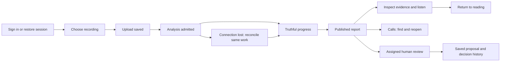

# Sales Xray: what is still missing from the UX/UI work

Research date: 27 September 2026. Research-only handoff; no new images, application changes, provider execution or deployment. Two completed normal ChatGPT Pro reviews, a local source audit and an independent accuracy review inform this final synthesis. See [cloud adjudication](CLOUD-RESEARCH-REVIEW.md) and [source register](SOURCE-REGISTER.md).

## Decision

The design work is **not complete**. The useful next step is to close whole journeys and resolve the data behind the screens, then generate the specific missing references. Adding another fixed number of images would not resolve the gaps found here.

The existing library covers many topics but has not established a coherent, accepted application. There are **204 distinct images**: 192 original state images, ten corrections and two earlier concepts. The recorded review outcomes are 50 selected **with corrections**, 120 revise and 34 reject. A shortlist with unresolved corrections is not implementation acceptance. The extra **240 slots are planned, with zero generated**. The proposed 432 original states are a planning inventory, not a completion target or percentage.

The most important missing work is: reviewer and authentication journeys; continuity before and after analysis admission; report-schema and chart-data mapping; real Calls query semantics; supported-versus-proposed settings; and the ownership, correction and retention contracts for Prospects and persistent coaching. Most are not fifteen newly discovered bugs. Some behaviour already exists and needs consistent design and verification; some remains a proposal.

## Evidence and limits

- Source inspected at `e488f952b1aafc10761f304630965d8233a2e39b` in the existing Sales Xray release checkout. [Local audit](LOCAL-SOURCE-AUDIT.md) records 44 file hashes, exact source lines and fifteen findings.
- The design documents are working artifacts originally tied to `12441bb7b75c0d88575e6913652acc0e42606a99`. Existing uncommitted Admin settings work is preserved and is not treated as committed evidence.
- The controlled-source register and exact-ID intake were inspected. Controlled Drive document bodies were **not freshly fetched** in this audit. Brain/report/prospect intake is marked `candidate_not_runtime_policy`. This handoff identifies policy decisions; it does not silently approve them.
- The 25 September retained-report audit is historical evidence that exact quote/time bindings do not prove useful coaching or complete clips. It is not a statement about today's production state. No fresh live report, browser accessibility, audio listening, provider-quality or deployment test was run here.
- The visual counts come from the prior recorded review and delivery evidence; the 204 images were not re-reviewed this turn. Cloud reviewers receive only a sanitized inventory and constraints, not customer recordings, private Brain documents or repository access.

## Priority gaps and the additional work they actually need

P0 means a boundary must be resolved before enabling that capability; it does not block unrelated work. P1 means complete the affected release journey. The local audit contains the detailed source references for each numbered item.

| ID | Gap / classification | What is still needed | Evidence / exit condition |
|---|---|---|---|
| G01 · P1 | Reviewer invitation and acceptance — existing source, missing named design coverage | Admin selects exact report revision and lens; invite, recipient account, acceptance, assigned review; expired/revoked/wrong-account/duplicate branches. | Existing reviewer routes. One invitation identity and exact permitted report survive the whole journey. Invitation creation is not email delivery. |
| G02 · P1 | Reviewer correction versus adjudication — under-specified | Draft, submit, lost response, conflict, access revoked mid-edit, previous proposals and final decision boundary. | Existing review API preserves idempotency and 409 drafts. Saved feedback never silently becomes an adjudicated report or overwrites history. |
| G03 · P1 | Sign-in and cross-app return — under-specified existing flows | Google popup cancelled/closed, callback without opener, email-code invalid/expired/resend, changed terms, session expiry with a selected file or open call. | Exact current auth routes, safe return path and no cross-account protected cache. Do not promise an automatic browser-security bypass. |
| G04 · P1 | Upload before durable admission — under-specified | Distinguish selected local file, byte transport, saved recording and admitted analysis. Show leave/cancel/sign-out and reconciliation at each boundary. | Upload store survives navigation, not full reload transport. No safe-to-close claim until its relevant server confirmation; no duplicate paid work after response loss. |
| G05 · P1 | Calls workspace — richer capability proposed | Server versus loaded-page search/filter, total versus loaded count, sort, next-page errors, rename under a filter, stale refresh, honest duration. | Current filters cover loaded calls and durations are estimates. Precisely measured total-duration charts cannot be built from that projection. |
| G06 · P1 | Fourteen-part report completeness — adapter contract missing | Map each presentation point to actual schema/revision/field/evidence, including unsupported/empty/partial and language variants. | Presentation has fourteen points; legacy metadata has nine descriptors. Neither automatically proves missing content. Each supported section has a valid mapping; absence stays visible. |
| G07 · P0 | Conversation charts — data meaning unresolved | Per chart: artifact, clock, speaker/channel meaning, numerator/denominator, coverage, overlap, uncertainty and source drill-down. | Current measurement contract exposes physical channels and audio-clock data. Channel is not speaker, pitch is not confidence, evidence count is not skill. |
| G08 · P1 | Navigation and return — contract exists, sequence proof missing | Calls → report → review point → evidence → transcript → Return, plus mode change, deep link and source revision change. | Current tabs and proposed reading bookmarks use different mechanisms. Restore location/focus without rewinding audio; browser Back must have a deliberate meaning. |
| G09 · P0 | Detailed Prospects — proposed persistent capability | Person, business, opportunity, source-linked fact, unresolved fact, conflict, deliberate link/unlink, duplicate review, permissions and deletion consequences. | No presumed live CRM. All supplied relevant business facts need a place, including unclassified facts; do not infer unavailable or unrelated personal data. |
| G10 · P1 | Practice and longitudinal Brain work — proposed persistence | Learner-owned focus, notes/reflection, source revision, save/conflict, supersession and voluntary completion. Separate from prospect facts. | Current next-call view is report-derived/local selection. A practice screen alone does not implement Brain 3.0 or prove improvement. |
| G11 · P0 | Provider setup, test and activation — separate capability contracts | Credential reference, C2/C4/C5 support, model/schema compatibility, paid-test consent/cap, validation, activation revision and old in-flight plans. | Catalog distinguishes planned/implemented; mounted benchmark says HTTP test composition is absent. C5 selection is not proof of C4 analysis. BYOK is not an ordinary preferences toggle. |
| G12 · P1 | Account/profile settings — domain-specific confirmation | Revision conflict, accepted write/unconfirmed reread, draft after expired session; avatar steps only where mounted and supported; cross-app profile authority. | Current profile uses revision checks and reread. A separate avatar component is not proof of route availability or synchronization. |
| G13 · P1 | Allowances and requests — uncertain operation recovery | Original admin resumes, second admin encounters pending grant, storage unavailable, account switched, session expires, request resolution and notification failure. Define the owner's separate token-grant request. | Existing recovery distinguishes administrator identity. Grant applied, request resolved and notification delivered are three separate facts. Minute grants do not establish a token-grant capability. |
| G14 · P1 | Export and deletion — existing/proposed split | Actual DOCX pending/error/permission/retry flow; deletion requested/processing/completed and effects on audio, transcript, report, linked facts and review evidence. | Current DOCX download is not proof of a background export service. Other formats and cascade policy need separate contracts. Put secondary actions in overflow without hiding their consequences. |
| G15 · P1 | Standalone / learner / legacy / reviewer parity — missing entry-context matrix | Define shell, header, player, auth and return owner for each entry, without duplicate app chrome. | Learner embeds StandaloneStudio and earlier recordings use CallStudio. A standalone screenshot does not prove either experience. |

## Settings need a capability map, not just more pages

Use one discoverable settings structure, with role-appropriate groups. The following are recommended groupings, not claims that all controls exist.

| Surface | Required distinctions and states |
|---|---|
| Personal profile | Identity authority, display name, supported contact fields/avatar, editing revision, saved versus unconfirmed, sign-out with unsaved/uploading work. |
| Language and reading | Source language versus report language; future default versus current saved report; original quotation versus translated explanation. A display choice must not silently purchase regeneration. |
| Playback and accessibility | Speed, default presentation, reduced motion, keyboard and touch; identify session-only versus saved preferences. OS reduced-motion preference remains effective. |
| Usage and access | Available minutes, request-more state and its decision; separate pending/settled usage only where the canonical API supplies that distinction. The inspected account view combines used or reserved seconds, so label that honestly. Display a percentage only with a real denominator and period. Provider money and user minutes are separate. |
| Notifications | Requested channel, permission, preference save, delivery status, failure and retry authority. No WhatsApp/email sending or new integration follows merely from designing it. |
| Admin providers | Connection/catalog, capability per stage, model compatibility, test authorization, results, activation/history. Credentials never appear in ordinary report UI. |
| Admin Brain and quality | Exact source/prompt revision, semantic coverage, output validation, human feedback/adjudication and superseded reports. Version labels alone do not establish quality. |
| Data and help | Actual export, deletion/request status, account access and support reference. Present useful plain-language consequences; technical provenance belongs in an appropriate details view. |

Every setting needs actor, scope, storage authority, validation, pending/confirmed/conflict/error, applicability to current versus future work, and audit/undo semantics. Unsupported controls remain clearly documented proposals rather than convincing success mockups.

The owner's request to grant **tokens as well as minutes** remains explicit research scope. Determine whether tokens mean provider consumption, a customer entitlement or another access unit; identify its ledger, conversion (if any), expiry and authorization. Do not silently equate it to minutes, dollars or model tokens. No such grant contract was established by this source audit.

## Minimum complete journeys

The next design review should walk connected sequences. An existing selected image may cover several sequence edges; do not count renamed duplicates as new work.

That diagram is a UX model, not a replacement backend enum. It intentionally separates upload saving from analysis admission.

1. **First useful result:** sign-in → selection/consent → one start → saved/admitted → report → evidence → Calls reopen. Include response-loss and reload branches.
2. **Understand and act:** concise overview → complete section → exact clip/context → pause/resume/full call → transcript → return → next-call suggestion. Preserve uncertain/no-fit outcomes and missing evidence.
3. **Find and manage:** paginated Calls → scoped search/filter → rename → report → return to list. Include stale or removed records and approximate duration.
4. **Human review:** admin invitation → correct recipient → assignment → source inspection → proposal → confirmation/conflict → history. Keep adjudication distinct.
5. **Operational recovery:** request more access → authorized grant/reconciliation → request decision → notification status. Provider configuration → bounded test → reviewed result → activation is a separate journey.
6. **Proposed next capabilities:** deliberate prospect link and source facts; learner focus/reflection. Define their domain contracts before claiming persistence.

## Presentation changes worth designing next

Keep the compact learner-inspired shell, stable collapse control, consistent type, usable spacing and one audio session. The first report viewport should answer: what happened, what to keep, what to change, and where to hear it. The full report stays reachable without exposing every paragraph at once.

- Design one reusable review panel with meaningful title, short explanation, source action and return control. Desktop may use a focused dialog/panel; mobile adapts it to a sheet. Do not hide the active player's controls behind a modal's inert layer.
- Use readable titles for coaching references. Internal `Doc-3 · §20–§26` is provenance, not a useful standalone explanation. Show the actual source title/meaning when known; retain unavailable-source honesty when it is not.
- Start visualizations with defensible duration/coverage and source-moment timelines. Add question/turn/speaker views only when their artifact definitions pass G07. Each chart needs a keyboard/list/table path to the same evidence.
- Use compact call rows with meaningful date, status, approximate/measured duration and rename. Avoid repeated Calls/private-library headings and decorative sample activity.
- Show short, plain selected-language explanations and untouched source quotes. Stress-test long Hindi/Marathi/English text, not only short English fixture copy.
- Specify before, active, settled and reversed interactions: collapse, hover/focus, source selection, playback, rename, save conflict and reconnect. Still frames cannot establish timing or responsiveness.

The standards support measurable behaviour, not a particular visual theme: modal focus must enter/return and remain contained while active ([W3C dialog pattern](https://www.w3.org/WAI/ARIA/apg/patterns/dialog-modal/)); sticky audio/navigation must not entirely obscure keyboard focus ([WCAG focus](https://www.w3.org/WAI/WCAG22/Understanding/focus-not-obscured-minimum)); ordinary content must reflow at the relevant narrow equivalent width ([WCAG reflow](https://www.w3.org/WAI/WCAG22/Understanding/reflow.html)). The project's 44px touch goal is deliberately larger than WCAG 2.2 AA's 24px minimum/spacing alternatives ([target size](https://www.w3.org/WAI/WCAG22/Understanding/target-size-minimum.html)). These are proposed verification requirements here, not passed conformance results.

Gong documents transcript search, highlighted matches and selecting a transcript line to seek playback. This is a useful comparable interaction pattern, not evidence that copying Gong's entire product improves this app ([official call-content guide](https://help.gong.io/docs/explore-call-content)).

## What to reuse, defer or stop doing

- Reuse the current learner shell principles and `@ac/ui` action/interaction primitives. The inspected app is Next/React, CSS modules and Lucide; it does not currently declare Radix, shadcn, Recharts or a motion library in its app manifest. Evaluate a narrowly needed primitive before adding an entire UI stack.
- shadcn's controlled sidebar composition is a useful reference for stable ownership and collapse modes ([official sidebar](https://ui.shadcn.com/docs/components/radix/sidebar)). It is a candidate pattern, not a drop-in guarantee or authorization to migrate. Confirm exact package/version/license, React compatibility, keyboard behaviour and bundle cost before adoption.
- A richer table component will not fix query scope by itself. TanStack's manual server filtering consumes data already filtered by the application; server search and total counts still need an API contract ([v8 guide](https://tanstack.com/table/v8/docs/guide/column-filtering)).
- Do not add Three.js/Pixi.js or generated ornamental assets merely to make ordinary tables, dialogs and timelines feel premium. A concrete interaction or rendering bottleneck would need to justify that choice.
- Reuse the 76 explicitly linked refinement slots where the old reference already demonstrates the behaviour. Repair rejected shared shell/report/recovery references first.
- Defer full CRM automation, unrestricted provider promises, official skill radar scores, external enrichment, native apps and messaging automation. Those are separate capabilities, not missing polish.
- Do not preload every private report/audio file to hide loading. Preserve safe current content, scope caches to identity, and measure the actual slow transition.

## Three bounded implementation slices after research

| Slice | Deliverable | Required proof |
|---|---|---|
| 1 · One trustworthy call journey | Shared compact shell, auth return, upload admission/reconciliation, Calls reopen and real Account destination. | Exact call identity through double-submit/lost response/reload/account switch; one admission and appropriate provider execution count in controlled tests; no duplicate chrome or obscured action at desktop/mobile/zoom. |
| 2 · One understandable complete report | Revision-to-section map, compact overview, accessible source timeline, readable references, unified player, transcript/return and next-call suggestion. | Legacy/projected/partial and two-language fixtures; clips include required question/reply context; pause/resume/continue remains correct; no unsupported chart or seller score; comprehension review of actual rendered screens. |
| 3 · Reviewer and operator completion | Invitation/assignment/correction, profile conflict, allowance recovery and supported provider configuration/history. | Role isolation, expired/revoked states, saved-proposal versus adjudication, duplicate/reconciled grants, settings revisions affecting only intended work; notification delivery reported separately. |

Prospect persistence and longitudinal coaching proceed as separate contract-led slices. Their design research can continue; attractive screens must not substitute for settled ownership and retention semantics.

## Proof needed beyond image generation

1. A requirement → role → entry → state/transition → canonical field/action → selected reference → test → release receipt map. Preserve separate planned/generated/reviewed/accepted/uploaded/live statuses.
2. A connected executable prototype for each critical journey, using explicit fixtures and actual interaction semantics. A static PNG or gallery link is not this proof.
3. Content stress fixtures: very long call/name, multilingual text, missing source, conflicting facts, zero/unknown counts, partial audio, old report schema, access revoked, delayed response and changing settings.
4. Keyboard/screen-reader, 320-CSS-pixel equivalent reflow, 200% text/400% layout zoom as applicable, reduced motion, short laptop height and mobile keyboard/dock checks. Do not force all content into one viewport at accessibility zoom.
5. Meaningful server-backed identity, concurrency and idempotency checks. Money/reservation logic needs the repository's real-database evidence. No provider requests are run under this research task.
6. A small diagnostic usability round with representative sellers/reviewers/admins: explain takeaway and one action; find and hear supporting context; recover a delayed request; find an older call; distinguish saved feedback from approval. Record assistance, errors, time and misunderstanding. No such study has been conducted here, and a small round is not a population-level quality claim.
7. Performance measurement on named devices/networks/builds. Recommended field targets are LCP ≤2.5s, INP ≤200ms and CLS ≤0.1 at the 75th percentile, separated by desktop/mobile ([Web Vitals](https://web.dev/articles/vitals)). Treat lab measurements separately; do not invent field results for a testing-only app.
8. Exact staging and production receipts for the same promoted artifact, including upload → completed report, Calls reopen, playback and applicable role/access workflows. Research, source, image delivery and staging each prove different things.

## Next design batch selection rule

Do not dispatch all 240 planned slots now. First reconcile G01–G15, attach accepted data/action semantics to the relevant states, and select one repaired desktop/mobile shell. Then illustrate the critical transitions that still lack a usable reference. Generate another image only when it answers a named unresolved design question; reuse accepted references otherwise. Keep unsupported semantics and missing implementation evidence visible in the matrix.

This report does not set a new image quota, claim full Brain 3.0, choose a universally best provider, or declare v0.2 deployed. It answers what additional research, design contracts and verification are required to make those claims responsibly.

The next research deliverables are a role/entry transition map (G01–G04/G08/G15), a field-level evidence and persistence map (G05–G10), and an operator/settings capability map (G11–G14). Name their open decisions and evidence owners before implementation. These are bounded follow-on tasks; no additional research chats or automations were created for them during this audit.
