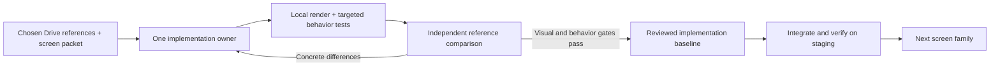

# Sales Xray: delivering the chosen UI one screen at a time

Research date: 27 September 2026. Decision proposal, not an implementation or performance benchmark. Prepared through AC Orchestra, a normal ChatGPT Pro research chat, two bounded research agents, primary documentation and local source inspection.

**Mode-selection update:** [Astra and Opus modes](ASTRA-OPUS-MODES.md) supersedes this document's starting model/effort table for the first demanding quality-calibration screen. It proposes Astra xhigh for the contract and independent review, Opus 5.5 xhigh as the initial sole writer, and a controlled high-versus-xhigh comparison. This is a research proposal, not a setting change or a proven model ranking.

The [completed Pro research chat](https://chatgpt.com/c/6ab8b0ab-0a80-83e9-857e-b9c4cf77f425) was collected and critically reviewed. Its proposals are not automatic instructions; `RESEARCH-REVIEW.md` records the decisions that differ from it. Start with this playbook, then `SCREEN-PACKET-TEMPLATE.md` and `PILOT.md`.

**Recommendation: Codex coordinates; one capable agent owns the screen; a separate agent reviews the rendered result; Luna handles bounded evidence and test work. Keep one screen family in progress. Introduce Paperclip only when cross-machine queue management becomes a measured bottleneck.**

The selected visual direction is the [existing company Drive library](https://drive.google.com/drive/u/0/folders/1akhxdM1yTs_IHwUneJ6HOjEcBP_HDhxF). Its saved delivery receipt records 204 images. Recent local expansion variants are unselected and excluded. This proposal does not require regenerating those designs or implementing all images at once. The old BRD is not used as current UI design authority.

## What the research supports

Claude Code supports focused subagents and experimental agent teams. Its documentation recommends simpler sessions/subagents when tasks are sequential, dependent or touch the same files. This is a strong fit for one screen plus its responsive states. It is not evidence that one vendor always produces better designs. [Claude teams](https://code.claude.com/docs/en/agent-teams), [subagents](https://code.claude.com/docs/en/sub-agents).

Codex supports narrow agents with explicit model and effort settings. Current guidance starts with Sol for demanding work and Luna for focused helpers. Higher effort adds latency and usage; it needs a reason. [Codex subagents](https://learn.chatgpt.com/docs/agent-configuration/subagents).

Anthropic's published multi-agent research case study reports substantial token overhead and warns that tightly dependent coding tasks are less parallelizable. Its research results are not a UI-delivery benchmark and must not be used to promise a Sales Xray speed multiplier. [Engineering case study](https://www.anthropic.com/engineering/multi-agent-research-system).

The missing discipline is a small work packet, clear file ownership, rendered comparison and a completion gate. A larger swarm cannot supply those automatically.

## Team and model allocation

These are provisional starting settings to test, not winners established by a benchmark or UI-specific vendor prescription. Record the exact resolved model and applied effort in each receipt. The pilot first tests the helper's contribution with the writer held constant, then separately calibrates model and effort.

| Role | Starting choice | Boundaries |
|---|---|---|
| Coordinator and integrator | Codex `gpt-6-sol`, medium; high for a difficult integration | Own queue, contracts, shared shell/tokens and final integration. Do not also edit a worker's active files. |
| First difficult visual implementation | Claude Code Opus 5.5, medium; high for ambiguous responsive architecture | Own one named screen family. Use only verified subscription capacity. Keep existing Drive style. |
| Implementation fallback | Codex `gpt-6-sol`, high for initial reference matching; medium after the pattern is stable | Same packet and acceptance bar when Opus is unavailable. Do not wait for Claude if Codex can complete the task. |
| Independent visual review | A fresh Sol/high session; Opus/high when Codex wrote it and included usage is available | Read the exact references and actual captures, then return concrete mismatches. No file writes or self-approval. |
| Test mapping, fixture inventory, failure triage | `gpt-6-luna`, high for reasoning over tests; low for deterministic extraction | Small, disjoint task; concise return. It must not invent product semantics or decide final visual taste. |
| Escalation | `gpt-6-astra` medium/high or Opus high/xhigh for a named unresolved problem | Escalate after evidence of repeated failure. No default max/ultra for routine spacing changes. |

Official OpenAI guidance distinguishes model/effort by workload and recommends testing the lightest setting meeting the quality bar. The current host exposes Luna, Sol and Astra; API names and UI labels still need to be recorded separately. [Model selection](https://developers.openai.com/api/docs/guides/model-selection).

Official Claude documentation identifies `claude-opus-5-5`, medium default, requiring Claude Code 2.1.280+. The installed package manifest here reports 2.1.281; the Codex CLI manifest reports 0.144.6. Package presence is not verification of Claude account quota, authentication or model entitlement. Avoid changing `opus` aliases without recording what they resolve to. [Claude model configuration](https://code.claude.com/docs/en/model-config).

**Concurrency policy:** one active implementation writer, one bounded read-only helper when useful, and a fresh review when captures are ready. The coordinator is the third role, not another competing designer. Only one heavy local build/test job runs at a time. No nested Codex → Claude → Codex loops. Helpers return their artifact and stop.

## How the two coding tools should cooperate

Begin with a shared, versioned screen packet and a task ledger, not shared unlimited conversational memory. The packet names a source revision, allowed files, current writer and review state. Claude writes its diff and evidence; Codex reads the same files and integrates only after review. If both are running in one checkout, the reviewer stays read-only. Separate worktrees are for actual independent edits, not one checkout per persona.

If automated dispatch later becomes necessary, use the supported Codex SDK/app-server and Claude's supported CLI/SDK with bounded execution. Current OpenAI docs state the older `codex mcp-server` command has been removed, so old tutorials that wire that command into Claude are not a suitable new integration. A bidirectional chain is unnecessary. [Codex SDK](https://learn.chatgpt.com/docs/codex-sdk).

Use one browser owner per session. Codex desktop computer interactions use its supported browser controls; deterministic tests run against an owned local application in isolated test contexts. Never repurpose the authenticated company Chrome profile as an unattended Playwright test profile.

## The unit of work

A **screen family** is one user task, its desktop/mobile adaptation, and relevant interactive states. An example is report overview with its navigation and shared player—not the whole report, all settings and every prospect workflow.

The packet contains two selected reference images, relevant corrections, their IDs and hashes; one compact shared design-system contract; existing route/data contracts; allowed source paths; stable test fixtures; state transitions; screenshots required; and the last short discrepancy list. Do not load all 204 images or the entire historical chat into every worker.

Use a searchable library index to retrieve the next reference only when its screen is ready. Reuse accepted shell, typography, spacing, icons, buttons, menus, fields and player components. Freeze the shared component revision per packet. A shared change explicitly lists the screens it may affect and runs that regression set.

Raster images communicate intent but do not define every CSS measurement or business rule. In the inspected overview pair, the desktop image is 1586×992 pixels and the mobile image is 853×1844. Their original prompts requested 1440×900 and 390×844 logical pixels respectively. The mobile output includes a drawn phone status bar despite the prompt's no-frame direction. **Output pixel dimensions alone do not establish the CSS viewport or device scale factor.** Use the documented intended sizes, define the content frame and reconcile the generated deviations before comparison; do not reproduce fake phone chrome in the web app or squeeze a long mobile page into one viewport.

## The delivery loop

1. **Inspect and specify.** Resolve reference identity, copy, data meaning, layout and navigation destinations. Reconcile image contradictions against the user's selected direction and current contracts. Flag unavailable capabilities; do not fabricate chart scores, successful analysis or saved prospect data.
2. **Build the composition first.** Match layout, hierarchy, content density, type scale and scrolling. Reuse the existing implementation; avoid a new app scaffold. Use fixtures for deterministic iteration, clearly separated from real integration.
3. **Complete behavior and responsive states.** Wire actions, focus, validation, recovery and narrow layouts. Add motion after the structure works. No dead controls or hover-only essential information.
4. **Render and compare.** Save viewport and full-page captures, plus relevant menus/dialogs and a short trace when motion or navigation is disputed. The reviewer sees selected references alongside actual captures at the agreed frame/scale. List the largest specific differences first.
5. **Correct and retest the affected work.** Two repeated correction rounds on the same unresolved issue trigger a diagnosis or clearer contract, not another broad redesign. This is an escalation rule, not permission to accept unfinished work.
6. **Accept with evidence.** No unresolved critical/high visual or behavior defect; no missing required state. The coordinator adjudicates against the owner-selected references and records any accepted deviation. Ask the owner only when a material design preference or business decision cannot be resolved from existing direction; do not add a permission question to every routine screen.
7. **Create the regression baseline only now.** A screenshot of unfinished code must not become the expected truth. Keep the Drive design reference and the reviewed implementation baseline as separate artifacts. Never update snapshots just to make a failing test pass.
8. **Integrate, then proceed.** Verify the accepted screen in the actual app shell and staging journey. Continue the next screen only after the previous one has a review receipt. Production batches follow existing release checks and rollback procedures, not one deploy per CSS tweak.

Playwright snapshots detect changes in a controlled render environment. They do not measure whether an AI-generated design was faithfully implemented. Pin OS/browser/fonts/fixtures and review differences; no universal pixel percentage establishes quality. [Visual comparisons](https://playwright.dev/docs/test-snapshots).

## Checks that make the polish concrete

| Area | Required evidence for the affected screen |
|---|---|
| Desktop composition | Agreed reference frame plus realistic laptop sizes such as 1366×768 and 1440×900. Header/sidebar/player must not consume the useful viewport or hide actions. Full-page evidence for any claim of vertical fit. |
| Mobile and reflow | Representative 390×844 and 360×800 CSS viewports, a 320px reflow check, tablet where relevant, and actual breakpoint edges. These are proposed test sizes, not measured dimensions of the image files. |
| Content stress | Long names, long report text, empty/partial data, English/Marathi mixed scripts, negative/zero/unknown values. Verify Devanagari glyphs and line height; do not clip qualifiers to imitate an image. |
| Interaction | Keyboard reachability, focus restoration, Escape, route Back/return-to-section, selected state, pending/success/error feedback and recovery. Test real action outcomes, not only clicks. |
| Audio/report | One audio state owner; clip play/pause both work, excerpt bounds and full-call escape are explicit, source links match the selected evidence, transcript times are readable. |
| Motion | Brief transitions explain movement and preserve orientation; interaction stays responsive; reduced-motion mode retains equivalent feedback. Visual state must not depend only on animation or color. |
| Accessibility | State-specific axe checks plus keyboard and manual review. Automated scans do not establish full accessibility. |
| Integration | Same call identity through upload/reconnect/report/library, actual saved status, permissions and live contract responses. Synthetic rendering evidence is not proof of production behavior. |

Run an explicit installed-Chrome check for report audio and navigation using an isolated test profile. Playwright's bundled Chromium is not identical to branded Chrome, including codec support. Add targeted Firefox/WebKit smoke checks sequentially where the supported-browser contract requires them; WebKit emulation is not a physical Safari/iPhone result. [Playwright browsers](https://playwright.dev/docs/browsers).

The 320 CSS-pixel reflow check has defined exceptions for intrinsically two-dimensional content. Automated accessibility has documented limits. Browser emulation also does not fully prove physical iPhone/Android behavior; record any real-device testing as a separate evidence item. [W3C reflow](https://www.w3.org/WAI/WCAG21/Understanding/reflow), [Playwright accessibility](https://playwright.dev/docs/accessibility-testing), [emulation](https://playwright.dev/docs/emulation).

For this app, “Apple-like” should mean legible hierarchy, stable geometry, deliberate materials, coherent controls and responsive feedback. Preserve the chosen Drive identity; do not turn this into a glass-effect redesign or a library's default dashboard. Apple HIG is a useful reference for motion/material intent, not a web compliance standard. [Apple motion](https://developer.apple.com/design/human-interface-guidelines/motion), [materials](https://developer.apple.com/design/human-interface-guidelines/materials).

## Keep the existing toolchain small

Local source inspection found Next 16.3.3, React 19.2.8, `@ac/ui`, Lucide, Vitest 4.1.11 and root Playwright 1.58.2. Existing scripts include `verify-sales-xray-viewport.mjs`, `verify-sales-xray-new-call-navigation.mjs` and `sales-xray-review-controls.test.mjs`. The viewport script already has synthetic request interception, long-content and motion modes, and geometry checks. Extend these where needed rather than duplicate them. They were read, not run during this research.

| Repository/tool | Use or decision |
|---|---|
| [microsoft/playwright](https://github.com/microsoft/playwright) | Keep for repeatable browser checks; Apache-2.0 project. Official CLI/skills guidance offers a lighter agent interface than repeated large MCP snapshots; savings here remain unmeasured. Existing scripts may be sufficient. |
| [storybookjs/storybook](https://github.com/storybookjs/storybook) | Optional MIT component-state workbench. Add only when existing fixture routes cannot isolate important states; avoid another server by default. |
| [radix-ui/primitives](https://github.com/radix-ui/primitives) / [shadcn-ui/ui](https://github.com/shadcn-ui/ui) | MIT source candidates for specific behavior gaps, after inspecting existing `@ac/ui`. No wholesale theme replacement. Components still need correct labels and integration. |
| [dequelabs/axe-core](https://github.com/dequelabs/axe-core) | MPL-2.0 accessibility engine; useful bounded checks, not a full accessibility verdict. Verify exact dependency notices before adding. |
| [paperclipai/paperclip](https://github.com/paperclipai/paperclip) | Durable coordination candidate, discussed below. Not installed. |
| [smtg-ai/claude-squad](https://github.com/smtg-ai/claude-squad) / [ruvnet/ruflo](https://github.com/ruvnet/ruflo) | Examples of session/worktree and larger coordination approaches. No evidence found that they improve this app's reference fidelity; no recommendation to install them now. |

[Official Playwright coding-agent CLI guidance](https://github.com/microsoft/playwright/blob/main/docs/src/getting-started-cli.md) and [Storybook interaction testing](https://storybook.js.org/docs/writing-tests/interaction-testing) support the tool capabilities. Repository popularity and demo videos are not comparative UI-quality evidence.

## Paperclip decision and limits

Paperclip's `claude_local` and `codex_local` adapters can use existing subscription-authenticated CLIs. It can help preserve tasks, claims, dependencies and runs across machines. At inspected upstream commit `640dee18029f7651d56ae0f1828d04228f9ab044`, however, budget metrics use `billed_cents` with monthly/lifetime windows. That does not implement a five-hour Claude percentage cap. It also requires its own service/data/auth/backup maintenance. [Claude adapter](https://github.com/paperclipai/paperclip/blob/640dee18029f7651d56ae0f1828d04228f9ab044/docs/adapters/claude-local.md), [Codex adapter](https://github.com/paperclipai/paperclip/blob/640dee18029f7651d56ae0f1828d04228f9ab044/docs/adapters/codex-local.md), [budget source](https://github.com/paperclipai/paperclip/blob/640dee18029f7651d56ae0f1828d04228f9ab044/packages/shared/src/constants.ts#L811-L818).

Adopt it only after the first accepted screen families if lost handoffs, restarts or cross-host scheduling are materially wasting time. Pilot with one sandbox repository, one worker, one browser-test runner and no production credentials; demonstrate claim exclusivity, timeout/cancellation, persisted receipts, quota stop/resume and no duplicate task execution. Its example/default worker settings are not automatically our permission or resource policy.

Remote execution may relieve laptop CPU/RAM pressure. That is separate from agent reasoning quality. Prefer an isolated development worker/preview, with measured headroom and pinned fonts/browser, over building inside production containers. Hosting and maintenance costs are unknown until measured; no VPS purchase or Paperclip installation was performed here.

## Usage controls and measurement

Paperclip's current documentation also describes five-hour/daily/weekly quota displays, identifying provider, estimated or cached readings. This is useful visibility and must not be confused with its separate dollar-budget mechanism or a tested guarantee that Claude never uses extra credits. Reconcile provider authentication, billing settings and quota state directly. The quota-view claim is documentation-verified, not tested on this account. [Paperclip costs and quota](https://docs.paperclip.ing/guides/day-to-day/costs/).

For Claude, verify effective subscription authentication and disable Usage credits/auto-reload before resuming future implementation. Non-interactive launches must not silently pick up an API key or gateway. Read actual quota/reset status, including weekly limits; a five-hour sleep alone does not prove capacity. This research did not change those settings or invoke Claude. [Authentication](https://code.claude.com/docs/en/authentication), [usage credits](https://support.claude.com/en/articles/12429409-manage-usage-credits-for-paid-claude-plans).

Reduce repeated context, not acceptance criteria: current-screen images only, compact instructions, exact relevant source paths, cached accepted components, deterministic scripts, short defect lists, and continuation within the same screen session. Do not put every plugin, MCP schema and research document into every worker. Current OpenAI guidance also recommends revisiting accumulated prompt/skill bulk. [Skills and prompts](https://developers.openai.com/blog/rethinking-skills-and-prompts-for-gpt-6-astra).

Measure total model usage across coordinator, writer, helpers and review; elapsed active time versus quota wait; repair rounds; unreviewed changes; escaped defects; and accepted screen families. Subscription allowance is not zero resource consumption. API-equivalent estimates are not cash charged. Include failed attempts and coordination overhead. No token savings or speed gain has been measured in this task.

The proposed pilot, screen packet and source register are adjacent files. The recommended first candidate is **report overview with its shared shell/player**, followed by its relevant responsive and error/empty states. Before code begins, reconcile the candidate with current source contracts and the required controlled-document reads. The packet is a proposal, not approval of every depicted capability. This candidate provides a demanding visual calibration before routine screens reuse its accepted components.

## Evidence and independent review

Use the existing skills as bounded roles: AC Orchestra for research/coordination, workflow-ui-production for the screen and acceptance loop, and the available browser-testing workflow for actual evidence. Load only the relevant skill sections per task. A frontend design skill must preserve the selected visual direction; it is not permission to invent another theme. No skill installation is needed for the proposed pilot.

The coordinating agent directly inspected the original overview desktop/mobile PNGs, read their generation prompts and measured their headers/hashes; these facts are recorded in `INPUTS.json`. Specialist research lanes did not inspect those images independently. Their statements about their own access do not substitute for the coordinator's receipt. A saved delivery receipt and the user's selection establish the original library's direction; individual Drive revisions were not freshly reconciled here.

Independent review checked model naming and challenged acceptance, provenance and pilot scope. The synthesis adopts delegated evidence-based acceptance, with owner input only for unresolved material decisions. It does **not** adopt a specialist's proposed mandatory human sign-off on every screen. See `RESEARCH-REVIEW.md` for dispositions.
